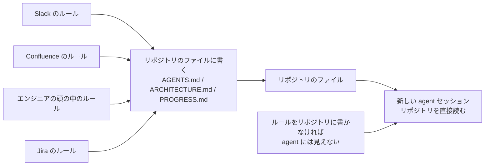
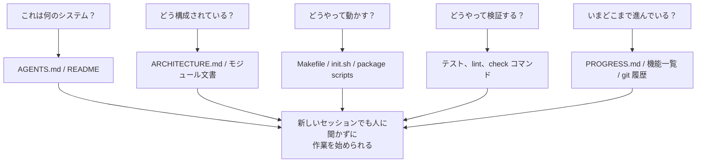

[英語版 →](../../../en/lectures/lecture-03-why-the-repository-must-become-the-system-of-record/)

> 本文のコード例：[code/](https://github.com/walkinglabs/learn-harness-engineering/blob/main/docs/zh/lectures/lecture-03-why-the-repository-must-become-the-system-of-record/code/)
> 実践演習：[Project 02. 让 agent 看懂项目、接住上次的工作](./../../projects/project-02-agent-readable-workspace/index.md)

# 第三講. コードリポジトリを唯一の事実の源にする

あなたのチームのアーキテクチャ上の決定は、Confluence、Slack、Jira、そして何人かのベテランエンジニアの頭の中に散らばっています。人間にとっては、それでもなんとか足ります。同僚に聞けばいいし、チャット履歴を検索してもいいし、ドキュメントを読み返してもいい。どうしても無理なら、給湯室でつかまえて直接聞く手もあります。けれど AI agent にとっては、リポジトリの外にある情報は存在しないのと同じです。

これは大げさではありません。agent に入る情報を考えてみてください。システムプロンプトとタスクの説明、リポジトリ内のファイル内容、そしてツール実行の出力。この3つだけです。Slack の履歴、Jira のチケット、Confluence のページ、金曜の午後に同僚と給湯室で話したアーキテクチャの決定、そういったものは agent には一切見えません。「ちょっと聞いてみる」こともできないし、「チャット履歴を探す」こともできません。リポジトリの中に閉じ込められたエンジニアのようなもので、リポジトリの外のことは何も知りません。

では問題はこうなります。このエンジニアに、きちんとした地図を渡すのか、渡さないのか。

## 地図に何を描くか

OpenAI は harness engineering の記事でこの問題を非常に率直に述べています。**リポジトリに存在しない情報は、agent にとって存在しないのと同じです。** 彼らはこれを「リポジトリ即規範」の原則と呼んでいます。つまり、リポジトリそのものが最上位の仕様書だということです。

Anthropic の long-running agents に関するドキュメントも、同様の考え方を強調しています。永続化された状態は、長いタスクの連続性に不可欠です。セッションをまたいだ知識の復元可能性が、タスクの成功率を直接左右します。そして、その状態はリポジトリの中になければなりません。なぜなら、そこだけが agent にとって安定してアクセスできる唯一の保管場所だからです。

「うちは少人数だし、知識はみんなの頭の中にある。これでもちゃんと回っているじゃないか」と思うかもしれません。確かに、人間ならそれでやれてしまいます。ですが agent を使うなら、ひとつ受け入れなければならない事実があります。agent は人に質問できません。必要な情報はすべて書き出して、agent が見つけられる場所に置く必要があります。

これは「もっと文書を書く」話ではありません。決定に関する情報を、正しい場所に置くという話です。`src/api/` 配下にある 50 行の `ARCHITECTURE.md` は、Confluence にある 500 ページの、誰も保守していない設計文書より、はるかに役に立ちます。たとえば、あなたの机に貼ってある手書きの社内動線図は、見栄えのする建築図面を保管庫にしまっておくよりずっと実用的です。必要なときにすぐ手元にあるからです。

## 知識の可視性



地図が十分に描けているかどうかは、どう確かめればよいのでしょうか。「コールドスタートテスト」を行います。新しい agent セッションを立ち上げ、リポジトリの内容だけを見せて、次の5つの基本質問に答えられるか確認します。



もし答えられないなら、地図に空白があるということです。空白があると、agent は自分で推測するしかありません。推測が外れれば bug になり、推測しすぎればコンテキストを無駄にします。しかも新しいセッションのたびに毎回やり直しです。最初から地図を描いておくほうが、結果としてずっと安くつきます。

## 重要概念

- **知識の可視性ギャップ**: プロジェクト全体の知識のうち、リポジトリに入っていない割合です。ギャップが大きいほど、agent が失敗する確率は高くなります。このプロジェクトについて頭の中にある暗黙知をすべて数え上げ、そのうちどれだけがリポジトリに書かれているかを見れば、その差分が可視性ギャップです。
- **System of Record**: コードリポジトリを、プロジェクトの決定、アーキテクチャ上の制約、実行状態、検証基準における権威ある情報源として扱う考え方です。リポジトリが言うことが正しく、他の場所が言うことは正しくありません。地図に「この道は通行止め」と書いてあれば、その道にはもう進みません。けれどその情報が老張の頭の中にしかないなら、毎回老張に聞かなければなりません。
- **コールドスタートテスト**: 前の節で挙げた5つの質問です。いくつ答えられるかで、地図の完成度が分かります。
- **発見コスト**: agent がリポジトリ内で重要な情報を見つけるために消費するコンテキスト量です。情報が隠れているほど発見コストは高くなり、実際のタスクに使える予算は減ります。重要な情報を10階層先の README に隠すのは、消火器を地下の金庫に鍵をかけてしまうようなものです。存在しないのではなく、必要なときに見つけられないのです。
- **知識の減衰率**: リポジトリ内で、一定時間あたりに古くなる知識項目の割合です。文書とコードの乖離は最大の敵です。文書がないことより危険なのは、古い文書です。
- **ACID の比喩**: データベースのトランザクション管理原則（原子性、一貫性、分離性、永続性）を、agent の状態管理に当てはめる考え方です。後で詳しく説明します。

## どうやってこの地図をうまく描くか

**原則 1: 知識はコードの近くに置く。** API エンドポイントの認証に関するルールは、巨大な全体文書の中に隠すのではなく、API コードのそばに置くべきです。各モジュールのディレクトリには、短い文書を置いて、そのモジュールの責務、インターフェース、特別な制約を明確に書きます。図書館の棚ラベルのようなものです。歴史の本を探したいなら、「歴史」と書かれた棚に行けばよく、図書館全体をひっくり返す必要はありません。

**原則 2: 標準化された入口ファイルを使う。** `AGENTS.md`（または `CLAUDE.md`）は agent の「着陸ページ」です。すべての情報を含める必要はありませんが、「これは何のプロジェクトか」「どう動かすか」「どう検証するか」の3つにすぐ答えられるようにしておく必要があります。50〜100 行で十分です。

**原則 3: 最小でありながら十分に完備していること。** それぞれの知識には、明確な使用場面が必要です。あるルールを削除しても agent の判断品質に影響しないなら、そのルールは存在すべきではありません。ただし、コールドスタートテストの各質問には必ず答えが必要です。これは繊細なバランスです。多すぎず、少なすぎず、ちょうどよく足りている状態を目指します。

**原則 4: コードと一緒に更新する。** 知識の更新をコード変更と結びつけます。最も簡単なのは、アーキテクチャ文書を対応するモジュールのディレクトリに置くことです。コードを変えると自然に文書が目に入り、変更後には CI が文書更新の必要性を確認するよう促してくれます。

**具体的なリポジトリ構成**:

```
project/
├── AGENTS.md              # 入口: プロジェクト概要、実行コマンド、ハード制約
├── src/
│   ├── api/
│   │   ├── ARCHITECTURE.md  # API 層のアーキテクチャ上の決定
│   │   └── ...
│   ├── db/
│   │   ├── CONSTRAINTS.md   # データベース操作のハード制約
│   │   └── ...
│   └── ...
├── PROGRESS.md             # 現在の進捗: 何をしたか、何をしているか、何に阻まれているか
└── Makefile                # 標準化された操作コマンド: setup、test、lint、check
```

## ACID 原則で agent の状態を管理する

この比喩はデータベースのトランザクション管理に由来します。単純なことをわざわざ難しくしているように見えるかもしれませんが、実際には非常に実用的な枠組みを与えてくれます。

- **原子性**: たとえば「新しいエンドポイントを追加してテストも更新する」といった1つの「論理操作」は、1つの git commit にまとめて原子化します。途中で失敗したら `git stash` で巻き戻します。やるなら全部、やらないなら全部やらない。中途半端はありません。
- **一貫性**: 「一貫した状態」を定義する検証条件を決めます。たとえば、すべてのテストが通っていて、lint にエラーがないことです。agent は各操作のあとに検証を実行し、一貫していない中間状態は commit しません。銀行振込と同じで、引き落としだけして入金しないわけにはいきません。
- **分離性**: 複数の agent が並行して作業するときは、状態ファイルで競合を起こさないようにします。単純な方法は、agent ごとに別の進捗ファイルを持たせるか、git ブランチで分離することです。2人の料理人が同じ鍋に同時に塩を入れるわけにはいきません。入れすぎたら、誰の責任でしょうか。
- **永続性**: 重要なプロジェクト知識は、git で追跡されるファイルに永続化します。一時的な状態はセッションのメモリにだけあっても構いませんが、セッションをまたいで必要な知識はファイルに書き出す必要があります。頭の中にあるだけではだめで、紙に書いてこそ意味があります。

## ある実際の改修事例

あるチームは、約 30 のマイクロサービスからなる EC プラットフォームを保守していました。アーキテクチャの決定（サービス間通信プロトコル、データ整合性戦略、API バージョニングのルール）は、Confluence（古いものもある）、Slack（検索しづらい）、何人かのベテランエンジニアの頭の中（スケールしない）、そして断片的なコードコメント（体系立っていない）に散らばっていました。

AI agent を導入した後、タスクの 70% で人手による介入が必要になりました。失敗のほとんどは、agent が「みんな知っているのにリポジトリには一度も書かれていない」暗黙の制約を破ったことに起因していました。たとえば、新人社員に「昼に出前を取るときはグループチャットで順番に書く」と誰も教えないようなものです。本人が推測して、外して怒られても、結局ルールは誰も教えてくれません。

チームは次のような改修を実施しました。
1. リポジトリのルートに `AGENTS.md` を作成し、プロジェクト概要、技術スタックのバージョン、全体のハード制約を記載した
2. 各マイクロサービスのディレクトリに `ARCHITECTURE.md` を追加し、そのサービスの責務、インターフェース、依存関係を説明した
3. 集約した `CONSTRAINTS.md` を作成し、「禁止」「必須」という明確な言葉でハード制約を記録した
4. 各サービスのディレクトリに `PROGRESS.md` を追加し、現在の作業状態を記録した

改修後は、同じ agent がコールドスタートでも重要なプロジェクト質問すべてに答えられるようになり、タスク完了の品質が大きく向上しました。

## 要点

- リポジトリにない知識は、agent にとって存在しないのと同じです。重要な決定情報をリポジトリに入れるのは、最も基本的な harness への投資です。地図を描いておけば、道に迷いません。
- 「コールドスタートテスト」でリポジトリの質を確かめます。新しいセッションが、リポジトリだけを見て5つの基本質問に答えられるかを確認します。
- 知識はコードの近くに置き、最小限でありながら十分に完備し、コードと一緒に更新します。もっと文書を書くのではなく、情報を正しい位置に置くのです。
- ACID 原則で agent の状態を管理します。原子的な commit、一貫性の検証、並行実行の分離、重要知識の永続化です。
- 知識の減衰が最大の敵です。古い文書は、文書がないことより危険です。agent を誤った方向へ導きながら、自分では正しいと思い込ませてしまいます。

## 参考資料

- [OpenAI: Harness Engineering](https://openai.com/index/harness-engineering/)
- [Anthropic: Effective Harnesses for Long-Running Agents](https://www.anthropic.com/engineering/effective-harnesses-for-long-running-agents)
- [Infrastructure as Code — Martin Fowler](https://martinfowler.com/bliki/InfrastructureAsCode.html)
- [ADR: Architecture Decision Records](https://adr.github.io/)
- [The Twelve-Factor App](https://12factor.net/)

## 演習

1. **コールドスタートテスト**: あなたのプロジェクトで新しい agent セッションを立ち上げ、口頭のコンテキストを一切与えず、リポジトリの内容だけを見せます。そのうえで5つの質問をします。これは何のシステムか。どう構成されているか。どう実行するか。どう検証するか。今の進捗はどうか。答えられなかった質問を記録し、答えられるようにリポジトリを改善してください。

2. **知識の外在化を定量化する**: あなたのプロジェクトにある、開発作業に重要な決定と制約をすべて列挙してください。それぞれがリポジトリ内にあるか、リポジトリ外にあるかを記します。知識の可視性ギャップがどれくらい大きいかを計算します（全体に対する、リポジトリ外の割合です）。そのギャップを 10% 未満にする計画を立ててください。

3. **ACID 原則の評価**: この講で扱った ACID の比喩を使って、あなたのプロジェクトの状態管理を評価してください。原子性: agent の操作はきれいに巻き戻せるか。一貫性: リポジトリに「一貫した状態」を検証する仕組みはあるか。分離性: 複数 agent の並行作業で互いに干渉しないか。永続性: セッションをまたぐ知識はすべて永続化されているか。
