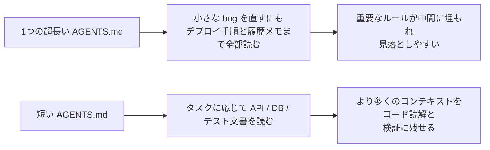
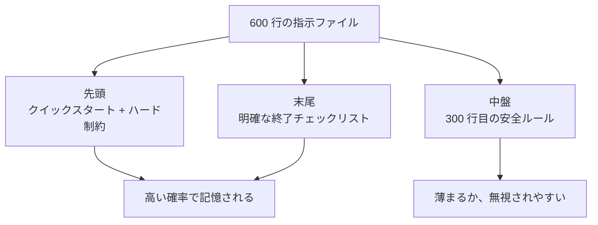

[英語版 →](../../../en/lectures/lecture-04-why-one-giant-instruction-file-fails/)

> 本記事のコード例：[code/](https://github.com/walkinglabs/learn-harness-engineering/blob/main/docs/zh/lectures/lecture-04-why-one-giant-instruction-file-fails/code/)
> 実践演習：[Project 02. agent にプロジェクトを読ませ、前回の作業を引き継がせる](./../../projects/project-02-agent-readable-workspace/index.md)

# 第4講. 指示を複数ファイルに分割する

あなたは harness を真剣に扱い始めた。それ自体は良いことだ。`AGENTS.md` を作り、思いつく限りのルール、制約、過去の教訓をすべて詰め込んだ。1か月後、そのファイルは 300 行に膨らみ、2か月後には 450 行、3か月後には 600 行になった。すると、agent の出来はむしろ悪化した。小さな bug を直すだけでも、agent は無関係なデプロイ手順に大量のコンテキストを使う。重要な安全制約は 300 行目に埋もれ、見落とされる。ファイルには互いに矛盾するコードスタイル規則が 3 つあり、agent は毎回そのどれかをランダムに選んでしまう。

これが「巨大な指示ファイル」の落とし穴だ。旅行バッグに荷物を詰めるのと同じで、何でも役に立ちそうに見えるから全部入れてしまう。するとファスナーは今にも壊れそうになり、着替えを探すにはバッグ全体をひっくり返さなければならない。荷物は一式あるのに、実際に使うのは 3 分の 1 ほどにすぎない。

## 問題の根っこ: 悪循環

いちばんよくある悪循環はこうだ。agent がミスをする → 「これを防ぐためにルールを足そう」と考える → `AGENTS.md` に追記する → ひとまず直る → agent が別のミスをする → また 1 条追加する → これを繰り返す → ファイルが制御不能に膨らむ。

あなたが悪いわけではない。これはとても自然な反応だ。問題が起きるたびに「ルールを足す」のは理にかなって見えるし、外出のたびに忘れ物を思い出してバッグに物を足すのにも似ている。しかし、その積み重ねは悲惨な結果を招く。実際に何が起きているのか見ていこう。

**コンテキスト予算が圧迫される。** Agent のコンテキストウィンドウには限りがある。たとえば、agent のウィンドウが 200K tokens だとしよう（Claude の標準）。肥大化した指示ファイルだけで 10〜20K を消費することがある。まだ余裕があるように見えるかもしれないが、複雑なタスクでは多数のソースファイルを読む必要があり、ツール実行の出力もコンテキストを食い、対話履歴も積み上がる。本当にコードを理解したい場面では、もう予算が足りない。まるで、バッグの中が「いつか使うかもしれない物」でいっぱいになり、本当に持っていくべきノート PC が入らなくなるようなものだ。

**中間埋没。** 「Lost in the Middle」という論文（Liu et al., 2023）は、長文の中間部分にある情報に対して、LLM が端よりかなり弱いことをはっきり示している。600 行ある `AGENTS.md` の 300 行目に「すべてのデータベースクエリはパラメータ化すること」と書いてあったとする。これは重要な安全制約だ。しかし中ほどに埋もれているため、agent はほぼ確実に見落とす。バッグの底にある日焼け止めと同じで、そこにあるのは分かっていても、3 回探しても見つからず、結局もう 1 本買うことになる。

**優先順位の衝突。** ファイルの中には、絶対に守るべきハード制約（「`eval()` を使ってはいけない」）、重要な設計指針（「関数型スタイルを優先する」）、特定の場面で得られた過去の教訓（「先週 WebSocket のメモリリークを修正した。似たパターンに注意すること」）が混在する。これら 3 つは重要度がまったく違うのに、ファイル上は同じ見た目に見える。agent には区別するための信頼できる手がかりがない。旅行バッグの中でパスポートと充電ケーブルが混ざっていて、どれが急ぎか分からないのと同じだ。

**保守の劣化。** 大きなファイルは本質的に保守しづらい。指示が古くなっても削除されない。削除による影響が読みにくいからだ（「他の場所がこのルールに依存しているかもしれない」）。一方で、新しい指示を足すのはほぼ無コストだ。その結果、ファイルは増える一方で減らず、信号対雑音比は下がり続ける。ソフトウェアにおける技術的負債の蓄積とまったく同じだ。

**矛盾の蓄積。** 時期の違う指示どうしが、やがて矛盾し始める。たとえば「TypeScript の strict mode を使う」とある一方で、「一部のレガシーファイルでは `any` を許可する」と書かれている。すると agent は毎回どちらかをランダムに選ぶ。親が「厚着しなさい」と言い、もう一方の親が「着すぎないで」と言うようなもので、玄関でどうすべきか分からなくなる。

## 基本概念

- **指示の肥大化**: 指示ファイルがコンテキストウィンドウの 10〜15% を超えると、コードを読むための余裕やタスク推論の余裕を圧迫し始める。600 行の `AGENTS.md` は 10,000〜20,000 tokens になることがあり、128K ウィンドウに対して 8〜15% を消費する。
- **中間埋没効果**: Liu らの 2023 年の研究は、LLM が長文の中間部分にある情報を、両端にある情報より明らかにうまく使えないことを示している。600 行ファイルの 300 行目にある重要な制約は、実質的に無視される可能性が高い。
- **指示の信号対雑音比（SNR）**: 現在のタスクに関連する指示が、全指示のうちどれだけの割合を占めるか。bug 修正のために 50 行のデプロイ手順を読まされるなら、SNR は低い。
- **ルーティングファイル**: agent をより詳しい文書へ誘導することを主目的とした、小さな入口ファイル。すべてを自分の中に抱え込むのではない。50〜200 行で十分だ。
- **段階的開示**: まず概要を渡し、必要になったら詳細を渡すこと。良い harness 設計は、良い UI 設計と同じで、すべての選択肢を一度にユーザーへ投げつけない。
- **優先順位の曖昧さ**: すべての指示が同じ形式・同じ位置で並んでいると、agent はどれが絶対に守るべき制約で、どれが助言レベルのソフトな指示なのか判別しにくい。

## 指示ファイルの構成





## 分割の考え方

基本原則は、よく使う情報は手元に置き、たまにしか使わないものはしまい込む。使わないものは持ち歩かない。

入口ファイル `AGENTS.md` は 50〜200 行に収め、最もよく使うものだけを置く。つまり、プロジェクトの概要（これは何のプロジェクトかを 1〜2 文で説明する）、最初に実行するコマンド（`make setup && make test`）、全体に効くハード制約（破ってはいけないルールは 15 条以内）、そして専門文書へのリンク（1 行の説明 + 適用条件）だ。

```markdown
# AGENTS.md

## プロジェクト概要
Python 3.11 の FastAPI バックエンド、PostgreSQL 15 データベース。

## クイックスタート
- インストール: `make setup`
- テスト: `make test`
- 完全検証: `make check`

## ハード制約
- すべての API は OAuth 2.0 認証を通すこと
- すべてのデータベースクエリは SQLAlchemy 2.0 の構文を使うこと
- すべての PR は pytest + mypy --strict + ruff check を通過すること

## 専門文書
- [API 設計規約](docs/api-patterns.md) — 新しいエンドポイントを追加するときは必読
- [データベース操作の制約](docs/database-rules.md) — データベース変更があるときは必読
- [テスト標準](docs/testing-standards.md) — テストを書くときの参照用
```

各専門文書は 50〜150 行に収め、`docs/` ディレクトリ配下、または対応するモジュールの近くに置く。agent は必要なときだけ読み込めばよい。バッグの中の仕分けポーチのようなものだ。下着用、洗面用、充電器用と分けておけば、バッグ全体をひっくり返さなくても探し物が見つかる。

また、コードの中に直接置いたほうがよい情報もある。たとえば型定義、インターフェースのコメント、設定ファイル内の説明だ。agent はコードを読むときに自然とそれらを目にするので、指示ファイル内で繰り返す必要はない。

各指示には、その出どころ（「なぜこのルールを追加したのか」）、適用条件（「このルールはいつ必要か」）、失効条件（「どんな条件ならこのルールを削除してよいか」）を明示するべきだ。定期的に棚卸しし、古いもの、冗長なもの、矛盾したものを削除する。コードの依存関係を管理するのと同じように指示も管理するのだ。使っていない依存関係は削除すべきで、そうしないとシステムを遅くするだけだ。

もしある指示をどうしても入口ファイルに置く必要があるなら、先頭か末尾に置くこと。中間には置かない。「中間埋没」効果があるため、LLM は長文の中間部分の情報を端よりうまく使えないからだ。ただし、もっと良い方法は、その指示を専門文書に置き、agent が必要なときに読み込めるようにすることだ。

OpenAI と Anthropic は、暗黙のうちにこの分割アプローチを支持している。OpenAI は入口ファイルを「短く、ルーティング指向にするべき」と述べ、Anthropic は長時間稼働する agent の制御情報は「簡潔で優先度が高いべき」と述べている。両社が言っているのは同じことだ。なんでも 1 つのファイルに詰め込むな、ということだ。バッグは整理しなければならない。力任せに押し込むだけではだめだ。

## 実例

ある SaaS チームでは、`AGENTS.md` が最初の 50 行から 600 行まで膨らんだ。中身は、技術スタックのバージョン、コーディング規約、過去の bug 修正メモ、API 利用手順、デプロイ手順、チームメンバーの個人的な好みまで混ざっていた。バッグはぎゅうぎゅう詰めで、ファスナーが今にも壊れそうだった。

その結果、agent の出来は目に見えて落ちた。簡単な bug 修正タスクでも、agent は無関係なデプロイ手順に大量のコンテキストを使ってしまう。安全制約「すべてのデータベースクエリはパラメータ化すること」が 300 行目に埋もれており、しばしば無視される。3 つの矛盾するコードスタイル規則のせいで、agent は毎回そのどれかをランダムに選んでしまう。

チームは「バッグの整理」を実施した。
1. `AGENTS.md` を 80 行まで削減し、プロジェクト概要、実行コマンド、15 条のグローバルなハード制約だけを残した
2. 専門文書を作成した: `docs/api-patterns.md`（120 行）、`docs/database-rules.md`（60 行）、`docs/testing-standards.md`（80 行）
3. 入口ファイルに専門文書へのリンクを追加した
4. 過去メモはテストケースに変換するか、削除した

リファクタ後、同じ種類のタスクでは無関係な手順を読む時間が減り、安全制約も見落とされにくくなった。理由は、その制約がファイルの中間からルーティングファイルの先頭へ移され、「中間埋没」されなくなったからだ。

## 要点

- 「ルールを足す」のは短期的には痛み止め、長期的には毒だ。ルールを追加する前に、そのルールは専門文書に置いたほうがよいかを考えること。バッグに何でも詰め込まない。
- 入口ファイルはルーターであって百科事典ではない。50〜200 行に収め、概要、ハード制約、リンクだけを置く。
- 「中間埋没」効果を活用すること。重要な情報はファイルの先頭か末尾に置き、重要でないものは専門文書へ移す。
- 指示の肥大化は技術的負債のように管理すること。定期的に棚卸しし、各指示には出どころ、適用条件、失効条件を持たせる。
- 分割すれば信号対雑音比が上がり、agent は無関係な指示ではなく、実際のタスクにより多くのコンテキスト予算を使える。

## 参考文献

- [OpenAI: Harness Engineering](https://openai.com/index/harness-engineering/)
- [Anthropic: Effective Harnesses for Long-Running Agents](https://www.anthropic.com/engineering/effective-harnesses-for-long-running-agents)
- [Lost in the Middle: How Language Models Use Long Contexts](https://arxiv.org/abs/2307.03172)
- [HumanLayer: Harness Engineering for Coding Agents](https://humanlayer.dev/articles/harness-engineering-for-coding-agents/)
- [Nielsen Norman Group: Progressive Disclosure](https://www.nngroup.com/articles/progressive-disclosure/)

## 演習

1. **SNR 棚卸し**: 今使っている入口指示ファイルを開き、すべての指示項目を書き出す。5 種類のよくあるタスクを選び、それぞれの指示がそのタスクに関連するかどうかを印を付ける。各タスクごとの SNR を計算する。大半のタスクにとってノイズになる指示は、専門文書へ移すこと。

2. **段階的開示の再構成**: 300 行を超える指示ファイルがあるなら、(a) 100 行以下のルーティングファイル、(b) 3〜5 個の専門文書に分割する。再構成前後で同じタスク群を実行し（少なくとも 5 個）、成功率を比較する。

3. **中間埋没の検証**: 長い指示ファイルの中で、重要な制約を先頭・中間・末尾にそれぞれ置き、同じタスク群を実行する（各グループ 5 回以上）。遵守率に差があるか確認する。位置の影響がどれほど大きいか、きっと驚くはずだ。
