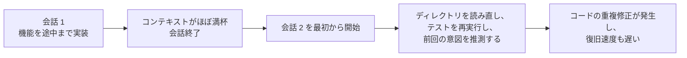
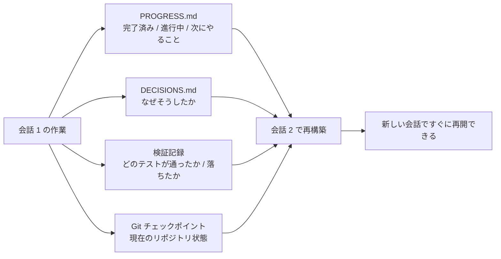

[英語版 →](../../../en/lectures/lecture-05-why-long-running-tasks-lose-continuity/)

> 本編のコード例：[code/](https://github.com/walkinglabs/learn-harness-engineering/blob/main/docs/zh/lectures/lecture-05-why-long-running-tasks-lose-continuity/code/)
> 実践演習：[Project 03. agent を再起動しても続きから作業できるようにする](./../../projects/project-03-multi-session-continuity/index.md)

# 第5講. 長時間タスクでコンテキストの連続性が失われる理由

Claude Code に完全な機能実装を依頼したとします。30 分ほど動かしたところで作業の大半は終わりましたが、コンテキストはほとんど埋まっていました。そこで新しい会話を始めて続きから進めると、前回どんな判断をしたのか、なぜ案 A ではなく案 B を選んだのか、どのファイルをすでに変更したのか、テストはどこまで進んだのかを覚えていません。結局、15 分かけてプロジェクトを調べ直すことになり、前回とは違うやり方で進めてしまう可能性もあります。

想像してみてください。あなたが職人で、毎朝起きるたびに昨日何をしたか思い出せないとしたらどうでしょう。昨日の時点でどこまで進んでいたのか、どの壁が途中まで積まれていたのか、なぜ赤レンガではなく青レンガを使ったのか、水道管や電気配線をどこまで通したのかを、毎回あらためて確認しなければなりません。さらに悪いことに、昨日すでに取り付けた窓を、取り付けたことを忘れて外してやり直してしまうかもしれません。

これが、AI coding agent が会話をまたぐタスクで直面する問題です。この講義では、なぜ agent が「記憶を失う」のか、そして構造化された状態を永続化することで、毎日日誌をつける職人のように振る舞わせるにはどうすればよいのかを扱います。記憶は失っても、日誌にすべて残しておくという考え方です。

## コンテキストウィンドウは無限ではない

コンテキストウィンドウには限界があります。これは、モデルを大きくすれば解決する種類の問題ではありません。たとえ 1M tokens まで広がっても、複雑なタスクでは結局使い切ります。agent はコードを生成するだけでなく、コードベースを理解し、自分の意思決定の履歴を追い、ツールの出力を扱い、対話の文脈を維持しなければならないからです。こうした情報の総量は、ウィンドウの拡張速度よりも速く増えていきます。

より深刻なのは、agent が生成する情報の重要度が均一ではないことです。途中の推論ステップには、意思決定の「なぜ」が含まれます。なぜ案 A ではなく案 B を選んだのか、なぜこのライブラリを使い、あのライブラリを使わなかったのか、なぜある最適化を見送ったのか。最終出力に残るのは「何をしたか」、つまりコードそのものです。圧縮戦略はたいてい後者を残し、前者を失います。次の会話はコードを見ても、それがなぜその形なのか分からないため、意図的な設計判断を「改善」として消してしまうかもしれません。

Anthropic の長時間稼働 agent 研究では、興味深い現象が報告されています。agent がコンテキストの上限が近いと感じると、早まって作業を終わらせようとする「過早収束」の振る舞いを見せるのです。検証を飛ばしたり、最適ではなく単純な案を選んだりします。試験時間がもうすぐ終わると気づいて、急いで適当にマークシートを埋めるようなものです。Anthropic はこれを「context anxiety」と呼んでいます。

## 会話継続の流れ

継続用の工件がない場合、新しい会話は毎回やり直しになります。



継続用の工件がある場合、新しい会話はすばやく再開できます。



## 基本概念

- **コンテキストウィンドウは有限**: モデルがどれだけ大きなウィンドウをうたっていても（128K、200K、1M など）、長いタスクでは必ず使い切ります。使い切ったら、圧縮するか（情報を失う）、リセットするか（新しい会話を始める）しかありません。どちらの場合も、何かは失われます。
- **継続用の工件**: 新しい会話が前回の続きへ曖昧さなく戻れるようにする、永続化された状態ファイルです。最小構成は、進捗ログ + 検証記録 + 次のアクションです。つまり、あの職人の日誌です。
- **再構築コスト**: 新しい会話が実行可能な状態に戻るまでに必要な時間です。良い harness なら、再構築コストを 15 分から 3 分へ下げられます。
- **ドリフト（Drift）**: agent の理解とコードベースの実際の状態のずれです。会話の境界が来るたびにドリフトは入り、放置するとどんどん大きくなります。
- **context anxiety**: Anthropic が観測した現象です。コンテキスト上限が近づくと agent が不自然な振る舞いを示し、情報を失う前に急いでタスクを終えようとします。非合理的な資源不安です。
- **圧縮 vs リセット**: 圧縮は、同じ会話の中でコンテキストを要約する方法です（「何をしたか」は残るが、「なぜ」は失われやすい）。リセットは、新しい会話を始めて永続化された状態から再構築する方法です（きれいですが、工件が十分であることに依存します）。

## 継続が途切れると何が起こるか

前の会話では、3 つの案の長短をかなりのコンテキストを使って分析し、最終的に案 B を選んだとします。次の会話の agent はその分析過程を知りません。そのため、不完全な情報に基づいて再び意思決定を行い、今度は案 A を選ぶかもしれません。まるで記憶を失った職人が、なぜ赤レンガを選んだのかを覚えておらず、今日は青レンガのほうが見た目がいいと思って、昨日の壁を壊して積み直してしまうようなものです。

さらに厄介なのは、作業の重複です。Agent は、その仕事が完了しているか確信できず、もう一度やってしまうことがあります。あるいはもっと悪く、途中まで進めたあとで既存の実装と衝突していると気づき、手戻りが発生します。工事現場で 2 組が同じ壁を同時に積むことはできません。しかし進捗記録がなければ、やってきた新しい人は、その壁がすでに誰かによって積まれていることを知りようがありません。

会話がいくつも積み重なると、実装の方向性は静かに当初の要件からずれていきます。各会話のプロジェクト理解に少しずつ誤差が入り、伝言ゲームのように、10 人を経るころには「コーヒーを買ってきて」が「コーヒーメーカーを買ってきて」に変わっていてもおかしくありません。

検証の抜けも生じます。前の会話での検証結果（どのテストが通り、どれが失敗し、なぜ失敗したか）が記録されていないと、新しい会話は現在の状態を知るために再度テストを回す必要があります。毎回診断をやり直し、毎回貴重なコンテキストを浪費することになります。

OpenAI と Anthropic はどちらも、ドキュメントの中で構造化された状態の永続化の重要性を強調しています。OpenAI の harness engineering 記事では、リポジトリを「操作記録」として扱い、各操作の結果が追跡可能な形でリポジトリに残るべきだとしています。Anthropic の long-running agents ドキュメントは、より具体的に「handoff file」の使用を推奨しています。これは、現在の状態、既知の問題、次のアクションを含む構造化文書です。

## 記憶をなくす職人のための日誌

基本方針は、**agent を記憶を失うスーパーエンジニアとして扱う** ことです。毎回「退勤」する前に重要な情報を書き残し、次に「引き継ぐ」agent がすぐに作業を再開できるようにします。

**ツール 1: 進捗ファイル（PROGRESS.md）**。これは最も基本的な継続用工件で、日誌の中核です。

```markdown
# プロジェクト進捗

## 現在の状態
- 最新の commit: abc1234 (feat: add user preferences endpoint)
- テスト状態: 42/43 が通過 (test_pagination_edge_case が失敗)
- Lint: 通過

## 完了済み
- [x] ユーザーモデルとデータベース移行
- [x] 基本 CRUD エンドポイント
- [x] 認証ミドルウェアの統合

## 進行中
- [ ] ページネーション機能 (90% - 境界条件テストが失敗)

## 既知の問題
- test_pagination_edge_case が空の結果セットで 500 を返す
- 一覧に削除済みユーザーを含めるべきか確認が必要

## 次にやること
1. ページネーションの境界条件バグを修正する
2. 「削除済みユーザーを含めるか」のクエリパラメータを追加する
3. API ドキュメントを更新する
```

**ツール 2: 決定ログ（DECISIONS.md）**。重要な設計判断とその理由を記録します。詳細な設計書は不要で、「何を決めたか、なぜ決めたか、いつ決めたか」だけで十分です。これは日誌のメモ欄です。

```markdown
# 設計判断

## 2024-01-15: ユーザー設定のキャッシュに Redis を使う
- 理由: 読み取り頻度が高い（API 呼び出しのたびに必要）、データ量が小さい
- 不採用案: PostgreSQL のマテリアライズドビューを使う（変更頻度が高く、維持コストに見合わない）
- 制約: キャッシュ TTL は 5 分、書き込み時に明示的に無効化する
```

**ツール 3: git commit をチェックポイントにする**。原子的な作業単位が終わるたびに commit します。commit message には、何をしたかと、なぜそうしたかを明確に書きます。これは、無料で使える自動バージョン管理の状態スナップショットです。

**ツール 4: init.sh または harness の初期化フロー**。`AGENTS.md` に、毎日の「出勤」と「退勤」の流れを書いておきます。

```markdown
## 各会話の開始時（出勤打刻）
1. PROGRESS.md を読んで現在の状態を確認する
2. DECISIONS.md を読んで重要な判断を把握する
3. `make check` を実行してリポジトリが整合していることを確認する
4. PROGRESS.md の「次にやること」から作業を続ける

## 各会話の終了前（退勤打刻）
1. PROGRESS.md を更新する
2. `make check` を実行して整合性を確認する
3. 完了した作業をすべて commit する
```

**ハイブリッド戦略**: 毎回コンテキストをリセットする必要はありません。短いタスク（30 分以内）なら、1 つの会話の中で終えられます。長いタスク（会話をまたぐもの）は、進捗ファイルと決定ログで連続性を維持する必要があります。目安として、タスクに必要なコンテキストがウィンドウの 60% を超えるなら、引き継ぎの準備を始めるべきです。

### context anxiety の深層分析

Anthropic が 2026 年 3 月に公開した研究では、context anxiety の具体的な現れ方がさらに明らかになりました。Sonnet 4.5 では、コンテキストがウィンドウ上限に近づくと、agent は強い「過早収束」を示します。試験時間がもうすぐ終わると気づいて、急いで選択肢を適当に埋めるのと同じです。

この現象に対する戦略は 2 つあります。

**圧縮（Compaction）**: 同じ会話の中で、初期の対話を要約します。利点は連続性を保てることで、agent は「何をしたか」を見られます。欠点は、「なぜ」が要約の中で失われやすいことです。案 B を A ではなく選んだ理由や、ある最適化を飛ばした理由などです。さらに重要なのは、圧縮だけでは context anxiety を消せないことです。agent は以前コンテキストが大きかったことを知っているため、心理的にはやはり急いで締めようとします。

**リセット（Context Reset）**: コンテキストを完全に消去し、新しい会話を開いて、永続化された工件から再構築します。利点は、心理状態がきれいになることです。新しい会話には「もう時間がない」という不安がありません。欠点は、引き継ぎ工件の完全性に依存することです。日誌に重要な情報が抜けていれば、新しい会話は誤った方向で時間を浪費するかもしれません。

Anthropic の公開記事では、Sonnet 4.5 では context anxiety が十分に深刻で、圧縮だけでは不十分だったと説明されています。そのため、コンテキスト reset が harness 設計の重要な要素になりました。一方で Opus 4.5 ではこの振る舞いが大幅に弱まり、reset に頼らずとも圧縮でコンテキスト管理が可能だったとされています。つまり、**harness の設計は対象モデルについて具体的に理解して行う必要があり、汎用テンプレートをそのまま当てはめるだけでは不十分** ということです。

> 出典：[Anthropic: Harness design for long-running application development](https://www.anthropic.com/engineering/harness-design-long-running-apps)

## 実例

ある agent に、ユーザー認証付きのブログシステムを実装するよう依頼したとします。機能は 12 個あり、5 回の会話が必要になる見込みです。

**日誌なしのベースライン**: 会話 1 ではユーザーモデルと基本ルーティングを実装しました。会話 2 の開始時、agent は認証ミドルウェアのインターフェース規約を覚えておらず、前回の設計意図を推測するのに約 15 分かかりました。会話 3 では、蓄積したドリフトのために、agent はすでに実装済みの機能を重複して作り始めました。会話 5 では、リポジトリには冗長コードが大量にあるのに、肝心の認証機能はまだ end-to-end テストを通っていませんでした。12 個の機能のうち 7 個しか終わらず、そのうち 3 個には潜在的な正しさの問題がありました。まるで日誌を書かない職人のように、5 日目には現場がぐちゃぐちゃで、二重に積まれた壁もあれば、そもそも積まれていない壁もある、という状態です。

**日誌ありの対照例**: 進捗ファイル、決定ログ、検証記録、git チェックポイントを使います。各会話の終了時に状態報告を自動更新します。会話 2 の再構築コストは約 3 分まで下がりました。会話 5 では、12 個すべての機能が完了し、検証も通過しました。

定量比較では、再構築時間が約 78% 減少し、機能完了率は 58% から 100% に上がり、潜在的欠陥率は 43% から 8% に下がりました。職人は相変わらず記憶を失う職人ですが、日誌があることで、毎日をゼロから始めるのではなく、前日に止めた場所から再開できます。

## 重要なポイント

- コンテキストウィンドウは有限な資源です。長いタスクは必ず会話をまたぎ、会話をまたぐと必ず情報が失われます。これは、職人が毎日記憶を失うのと同じで、客観的な現実です。
- 解決策は、より大きなウィンドウではなく、より良い状態の永続化です。進捗ファイル + 決定ログ + git チェックポイント。記憶を失う職人に、信頼できる日誌を渡すことです。
- agent は記憶を失うエンジニアとして管理します。毎回「退勤」前に、何をしたか、なぜそうしたか、次に何をするかを明記します。
- 再構築コストは重要な指標です。良い harness は、新しい会話が 3 分以内に実行可能状態へ戻れるようにすべきです。
- ハイブリッド戦略: 短いタスクは 1 会話内で完了し、長いタスクは構造化された工件で連続性を維持します。

## さらに学ぶ

- [Anthropic: Effective Harnesses for Long-Running Agents](https://www.anthropic.com/engineering/effective-harnesses-for-long-running-agents)
- [OpenAI: Harness Engineering](https://openai.com/index/harness-engineering/)
- [Lost in the Middle: How Language Models Use Long Contexts](https://arxiv.org/abs/2307.03172)
- [Claude Code Documentation](https://docs.anthropic.com/en/docs/claude-code)
- [HumanLayer: Harness Engineering for Coding Agents](https://humanlayer.dev/articles/harness-engineering-for-coding-agents/)

## 演習

1. **継続性損失の測定**: 少なくとも 3 回の会話を必要とする開発タスクを 1 つ選びます。継続用の工件を何も与えず、各会話の開始時に agent が「前回何をしていたか」を把握するためにどれだけコンテキストを使ったかを記録します。会話終了後に進捗ファイルを作成し、次の会話はその進捗ファイルから始めます。進捗ファイルあり・なしで再構築コストを比較してください。

2. **引き継ぎテンプレートの設計**: 4 つのフィールドを含む最小限の引き継ぎテンプレートを設計します。リポジトリ状態（commit hash）、実行時状態（テスト通過率）、ブロッカー、次のアクションです。まったく新しい agent 会話をこのテンプレートだけで状態復元させ、復元中に生じる曖昧さを記録して、テンプレートを反復改善してください。

3. **ハイブリッド戦略の実験**: 5 回の会話がある開発タスクで、次の 3 つの戦略を比較します。(a) 毎回新しい会話 + 進捗ファイル、(b) 同じ会話の中で可能な限り進める（コンテキスト圧縮）、(c) ハイブリッド戦略（短いタスクは会話内、長いタスクは会話をまたぐ + 進捗ファイル）。再構築時間、機能完了率、意思決定の一貫性を比較してください。
