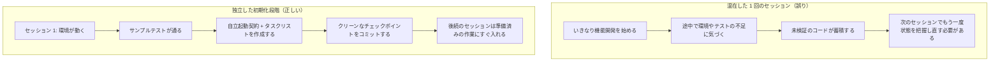

[英語版 →](../../../en/lectures/lecture-06-why-initialization-needs-its-own-phase/)

> 本講義のコード例：[code/](https://github.com/walkinglabs/learn-harness-engineering/blob/main/docs/zh/lectures/lecture-06-why-initialization-needs-its-own-phase/code/)
> 実践演習：[Project 03. agent を閉じて開き直しても続きから作業できるようにする](./../../projects/project-03-multi-session-continuity/index.md)

# 第六講. agent が作業を始める前に毎回初期化を行う理由

新しい agent セッションを開いて、「検索機能を追加して」と頼んだとします。agent はそのままコードの修正を始めます。意欲は十分です。20 分後に、テスト基盤がまだ整っていないことに気づき、さらに 10 分かけてテスト環境を整えます。次に、データベースのマイグレーションスクリプトの形式が違うことが分かり、また少し手を入れます。最終的に検索機能自体は追加できたものの、セッション全体の効率はかなり低くなりました。大半の時間が「このプロジェクトがどう動くのかを把握すること」に費やされ、検索機能そのものを書く時間はわずかでした。

より良いやり方は、agent に作業を始めさせる前に、独立した段階で基盤環境を整え、コマンドが実際に動くことを確認し、プロジェクト構成を理解しておくことです。家を建てるのと同じです。地盤を固めながら壁を積むことはできません。途中で地盤が乾いていなければ、建物全体を作り直すことになります。先に地盤を固め、乾いてから壁を積む。そうして初めて、最後まで一気に進められます。

この講義では、なぜ初期化を独立した段階に分ける必要があり、実装と混ぜてはいけないのかを説明します。

## 地盤と壁: まったく異なる作業

初期化と実装では、最適化すべき目標がまったく異なります。実装段階の目標は、検証済みの機能数と品質を最大化することです。初期化段階の目標は、その後のすべての実装の信頼性と効率を最大化することです。

初期化と実装を混ぜると、agent は多目的最適化の問題に直面します。基盤整備と機能実装を同時に求められるからです。明示的な優先順位がない場合、agent は自然とコードを書くほうに寄りがちです。なぜなら、それはすぐに目に見える成果だからです。一方で、基盤整備は価値が後続のセッションになって初めて現れるため、後回しにされやすいのです。これは、施工隊に地盤工事と壁の施工を同時にやらせるようなものです。目に見えて成果が出る壁を急いでしまいがちですが、地盤が不十分な家は後で体系的な問題を抱えます。

## 初期化のライフサイクル



## 混ぜて作業するとどうなるか

最も分かりやすい問題は、地盤が十分に固まらないことです。agent が力の 80% を機能実装に使い、残りの 20% で基盤を適当に整える、という状態になりがちです。テストフレームワークは入れたが検証していない、lint ルールは設定したが甘すぎる、進捗ファイルは作っていない。こうした欠陥は最初のセッションでは目立ちません。なぜなら、agent 自身は何をしたかを覚えているからです。しかし 2 回目のセッションで露呈します。新しい agent には、プロジェクトの起動方法、テスト方法、どこまで進んでいるかが分かりません。地盤が弱ければ、揺れたときにすべて崩れます。

より見えにくい代償は、「未検証の蓄積」です。テストフレームワークを整える前に書いた機能コードは、あとからテストを足す段階で、設計そのものに問題があると分かることがあります。本来なら別のやり方で実装すべきだった、ということです。地盤が乾く前にタイルを貼るようなものです。地面の平らさに問題があると分かった時点で、タイルはすべて剥がしてやり直しになります。

コンテキスト予算も無駄になります。初期化作業、つまり環境設定、テスト設定、プロジェクト構造の把握に大量の予算を使ってしまい、実際の機能実装に回せる量が減るのです。その結果、1 回目のセッションでは機能が半分しか進まず、2 回目のセッションでもまた最初からプロジェクトを理解し直すことになります。予算は地盤工事に使ったのに、地盤も十分に固まっていない。両方とも得をしません。

見落とされやすいのは、暗黙の前提が地雷になることです。初期化の過程で agent が下した判断、たとえばどのテストフレームワークを使うか、ディレクトリをどう整理するか、依存関係をどう管理するか、を明示的に残しておかないと、後続セッションが矛盾した選択をする可能性があります。1 回目の施工隊はコンクリート基礎を使い、2 回目の施工隊はそれを知らずに木杭を打つ。そうなると基礎は割れてしまいます。

Anthropic は、長時間稼働するアプリケーションの研究で、初期化と実装を分ける構成を紹介しています。公開記事で確認できる範囲では、専用の initializer が環境、feature list、progress record を用意し、その後の coding agent が段階的に進めます。重要なのは、初期化を実装と混ぜると、後続セッションの立ち上がりや判断が曖昧になるという点です。地盤がしっかりしているほど、その上の建物は速く建ちます。

OpenAI の Codex harness engineering ガイドでも、「リポジトリを操作記録として扱う」ことが強調されています。最初の実行時に明確な操作構造を作っておかないと、新しいセッションのたびにプロジェクトの約束事を推測し直すことになります。

## コア概念

- **初期化段階**: agent のライフサイクルにおける最初の段階。機能実装は行わず、その後のすべての実装段階の前提条件だけを整える。出力はコードではなく、基盤です。
- **自立起動契約**: 新しい agent セッションが曖昧さなくプロジェクトを扱えるための条件。起動できること、テストできること、進捗を確認できること、次の作業を引き継げること。この 4 つが欠けてはいけません。
- **コールドスタート vs ホットスタート**: コールドスタートは空のディレクトリから始める方法で、agent はプロジェクト構造を推測しなければなりません。ホットスタートはテンプレートや既存プロジェクトから始める方法で、基盤がすでに整っています。効果はホットスタートのほうがはるかに高く、通水・通電済みの工事現場で始めるほうが、何もない荒地から始めるよりずっと速いのと同じです。
- **引き継ぎ準備完了度**: プロジェクトが、いつでも「新しい agent がそのまま引き継げる」状態にあること。口頭説明に頼らず、リポジトリの内容だけを見れば続きから作業できます。
- **初回検証時間**: プロジェクト開始から最初の機能が検証に通るまでの時間。初期化の効率を測る中心指標です。
- **下流での利用可能性**: 初期化品質を測る最良の指標。後続セッションが暗黙知に頼らずにタスクを成功裏に実行できる割合です。

## 初期化をうまくやる方法

**初期化は独立した段階として実行してください。** 最初のセッションでは初期化だけを行い、業務機能のコードは一切書きません。初期化の成果物は次のとおりです。

**1. 実行可能な環境。** プロジェクトが起動でき、依存関係も揃っており、環境面の問題がない状態です。地盤が打たれ、ひび割れもありません。

**2. 検証可能なテストフレームワーク。** 少なくとも 1 つのサンプルテストが通ること。これでテスト基盤自体が正しく組み合っていると分かります。地盤の上に柱を 1 本立てて、荷重に耐えられることを示すようなものです。

**3. 自立起動契約の文書。** 後続セッションに次のことを明確に伝える文書です。
```markdown
# 初期化契約

## 起動コマンド
- 依存関係のインストール: `make setup`
- 開発サーバーの起動: `make dev`
- テストの実行: `make test`
- 完全検証: `make check`

## 現在の状態
- すべての依存関係がインストールされ、固定済み
- テストフレームワークを設定済み (`Vitest` + `React Testing Library`)
- サンプルテストが通過済み (1/1)
- Lint ルールを設定済み (`ESLint` + `Prettier`)

## プロジェクト構造
- src/ — ソースコード
- src/components/ — React コンポーネント
- src/api/ — API クライアント
- tests/ — テストファイル
```

**4. タスク分解。** プロジェクト全体を順序立ったタスクリストに分け、それぞれに明確な受け入れ条件を付けます。
```markdown
# タスク分解

## Task 1: ユーザー認証の基盤
- JWT 認証ミドルウェアを実装する
- ログイン/登録エンドポイントを追加する
- 受け入れ条件: `pytest tests/test_auth.py` がすべて通る

## Task 2: ユーザープロフィールページ
- ユーザープロフィールの CRUD を実装する
- プロフィール編集フォームを追加する
- 受け入れ条件: `pytest tests/test_profile.py` がすべて通る

## Task 3: 検索機能
- ...
```

**5. チェックポイントとしての Git コミット。** 初期化が終わったら、きれいな checkpoint を 1 つコミットします。その後の作業はすべてこの checkpoint から始めます。

**ホットスタート戦略**: 空のディレクトリから始めないでください。プロジェクトテンプレート (`create-react-app`、`fastapi-template` など) を使って、標準的なディレクトリ構成、依存関係設定、テストフレームワークをあらかじめ用意します。共通的な初期化手順はテンプレート側に入れておき、プロジェクト固有の初期化だけを残すのです。通水・通電済みの工事現場で始めるほうが、何もない荒地から始めるより圧倒的に速いのと同じです。

**初期化の完了条件**: 「どれだけコードを書いたか」ではありません。自立起動契約の 4 条件がすべて満たされていることです。起動できること、テストできること、進捗を確認できること、次の作業を引き継げること。このチェックリストで初期化を検収します。

```markdown
## 初期化の検収チェックリスト
- [ ] `make setup` がゼロから成功する
- [ ] `make test` で少なくとも 1 つのテストが通る
- [ ] 新しい agent セッションが、リポジトリだけを見て「どう起動するか」「どうテストするか」に答えられる
- [ ] タスク分解ファイルが存在し、少なくとも 3 つのタスクがある
- [ ] すべての内容が git にコミットされている
```

## 実例

React フロントエンドプロジェクトにおける 2 つの初期化方法の比較です。

**混在方式（地盤を作りながら壁を積む）**: agent は最初のセッションで、プロジェクトの足場作成と最初の機能実装を同時に行いました。セッション終了時点で、リポジトリには動くコードがありましたが、起動/テストコマンドの明示的な文書はなく、進捗追跡ファイルもなく、タスク分解もありませんでした。2 回目のセッションでは、プロジェクト構造、テストフレームワーク、ビルド手順を推測するのに約 20 分かかりました。新しく来た施工隊が工事現場を見ても、どこまで地盤を打ったのか、水道や電気の配管がどこを通っているのか分からず、ひとつずつ掘り返して確認するしかないのと同じです。

**独立した初期化（先に地盤を固める）**: 最初のセッションは初期化だけに集中しました。プロジェクトテンプレートでディレクトリ構成を作り、テストフレームワーク (`Vitest` + `React Testing Library`) を設定し、サンプルテストを書いて検証し、さらに自立起動契約の文書とタスク分解ファイルを作成し、初期チェックポイントをコミットしました。2 回目のセッションでは再構築にかかった時間は 3 分未満で、すぐにタスク一覧から作業を始められました。施工隊が来て、施工図を見ただけで続きの場所が分かる状態です。

プロジェクト全体のライフサイクルで比べると、混在方式の総再構築時間は、すべてのセッションを通して独立した初期化より約 60% 長くなりました。独立した初期化で最初に多く支払った 20 分は、その後のセッションで何倍にもなって回収されたのです。地盤がしっかりしているほど、その上に建てる効率はむしろ高くなります。遅く見えるほうが、実際には速いのです。

## 重要なポイント

- 初期化と実装では最適化の目標が異なり、混ぜると互いの足を引っ張るだけです。先に地盤を固め、そのあとで壁を積みましょう。
- 初期化の成果物はコードではなく基盤です。実行可能な環境、検証可能なテスト、自立起動契約、タスク分解を用意します。
- 「自立起動契約」の 4 条件、つまり起動できること、テストできること、進捗を確認できること、次の作業を引き継げること、で初期化を検収します。
- ホットスタートはコールドスタートより優れています。標準化された基盤はテンプレートで先に用意しておきましょう。
- 初期化に使った時間は、その後 3 〜 4 回のセッションで完全に回収できます。これは余分なコストではなく、前払いの投資です。地盤がしっかりしているほど、建物は速く建ちます。

## 参考文献

- [Anthropic: Effective Harnesses for Long-Running Agents](https://www.anthropic.com/engineering/effective-harnesses-for-long-running-agents)
- [OpenAI: Harness Engineering](https://openai.com/index/harness-engineering/)
- [HumanLayer: Harness Engineering for Coding Agents](https://humanlayer.dev/articles/harness-engineering-for-coding-agents/)
- [Infrastructure as Code — Martin Fowler](https://martinfowler.com/bliki/InfrastructureAsCode.html)
- [SWE-agent: Agent-Computer Interfaces](https://github.com/princeton-nlp/SWE-agent)

## 練習

1. **自立起動契約の設計**: いま開発しているプロジェクトについて、完全な自立起動契約を書いてください。そのあと、まったく新しい agent セッションを開き、リポジトリの内容だけを渡して（口頭の前提は与えずに）、プロジェクトの起動、テスト実行、現在の進捗把握を試させます。そこで起きた問題を記録してください。各問題は、自立起動契約で欠けていた項目 1 つに対応します。

2. **比較実験**: 中程度の複雑さを持つ新規プロジェクトを 1 つ選びます。方法 A: agent に初期化と最初の実装を同時に行わせる。方法 B: まず 1 回のセッションで独立した初期化を行い、2 回目のセッションから実装を始める。4 回のセッション後に、初回検証時間、再構築コスト、機能完了率を比較してください。

3. **初期化検収チェックリスト**: あなたのプロジェクト向けに、初期化用の検収チェックリストを設計してください。新しい agent セッションにその各項目を実行させ、どれが通り、どれが通らなかったかを記録します。通らなかった項目こそ、あなたの harness で補強が必要な箇所です。
