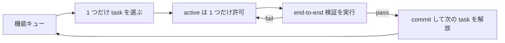
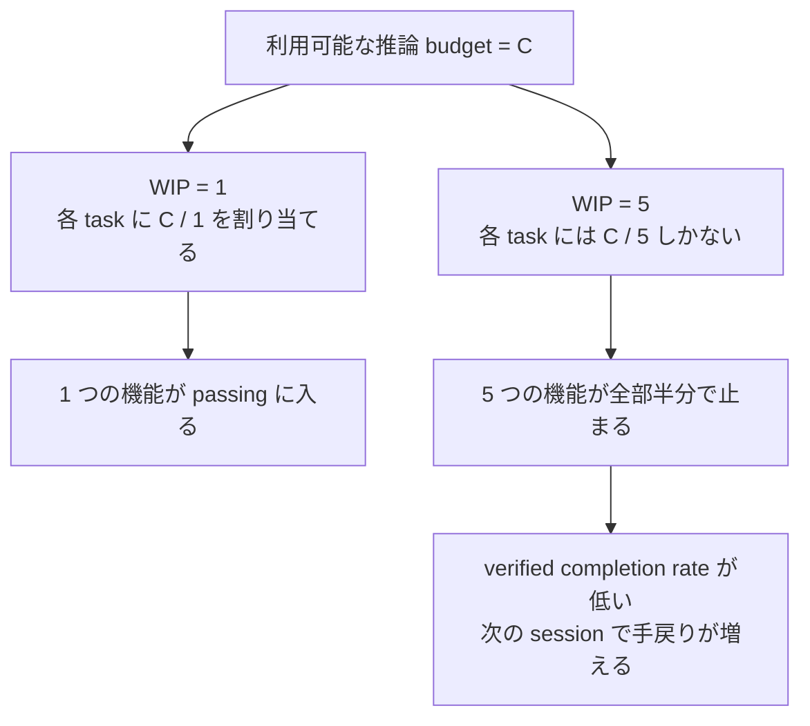

[英語版 →](../../../en/lectures/lecture-07-why-agents-overreach-and-under-finish/)

> 本章のコード例：[code/](https://github.com/walkinglabs/learn-harness-engineering/blob/main/docs/zh/lectures/lecture-07-why-agents-overreach-and-under-finish/code/)
> 実践演習：[Project 04. 実行フィードバックで agent の挙動を修正する](./../../projects/project-04-incremental-indexing/index.md)

# 第七講. agent の各タスクの境界を明確にする

Claude Code に「このプロジェクトにユーザー認証機能を追加して」と頼むと、データベース schema の変更、route の実装、frontend component の修正に加えて、ついでに error handling middleware の refactor まで始めてしまうことがあります。2 時間後に確認すると、12 個の file が変更され、800 行の新規 code が入っているのに、end-to-end で動く機能は 1 つもない。

「欲張っても消化しきれない」は、agent に当てはめると非常によく当てはまります。agent には本来、「もう少しやっておこう」という衝動があります。関連しそうなことを見つけると、つい一緒に手を付けてしまうのです。これは、スーパーで醤油 1 本だけ買うつもりが、気づけば山ほど入ったカートを押している人と同じです。違うのは、人間が買いすぎてもせいぜいお金を無駄にするだけなのに対し、agent がやりすぎると、どれも中途半端になることです。

Anthropic は "Effective harnesses for long-running agents" という engineering blog で、prompt が広すぎると agent は「1 件ずつ終わらせる」よりも「複数のことを同時に始める」傾向があると明確に述べています。OpenAI も Codex の engineering practice で、明示的な scope control がない task は completion rate が大きく落ちることを確認しています。これは model の問題ではありません。harness の中で境界をはっきり切っていないあなたの問題です。

## 注意力は有限な資源

これは比喩ではなく、数学です。agent の context 容量を C とし、同時に k 個の task を有効化すると、各 task が受け取る推論資源の平均は C/k になります。C/k が 1 つの task を完了するのに必要な最小閾値を下回ると、どの task も終わりません。胃袋の大きさが決まっているのと同じで、10 個の bun を一度に詰め込めば、1 個も消化できないというより、全部が消化不良になります。

Claude Code の実際の挙動は、この問題をよく示しています。たとえば「ユーザー登録機能を追加して」と頼むと、次のようになりがちです。

1. `User` model を作る
2. registration route を書く
3. email verification が必要だと気づいて mail service を追加する
4. password の暗号化が必要だと気づいて `bcrypt` を導入する
5. error handling が統一されていないことに気づいて global error middleware を refactor する
6. test file の構成が分かりにくいと気づいて directory structure を組み替える

6 ステップ後には、どれも未完成です。end-to-end の検証はなく、code 同士の結合は複雑になり、次の session が引き継ぐときには混乱します。まるで 6 品の料理を同時に炒めて、どれも鍋には入っているのに、一皿も完成していないようなものです。

Anthropic の実験データもこれを裏づけています。「small next step」戦略（WIP=1 と同等）を使った agent は、広い prompt を与えた agent より task completion rate が 37% 高かったのです。さらに興味深いのは、agent が生成した code 行数と、実際に完了した機能数が弱い負の相関を示したことです。書けば書くほど、完了は減る。「欲張っても消化しきれない」は、データでも証明されています。

## WIP=1 ワークフロー





## 基本概念

- **過度拡張（Overreach）**: agent が 1 回の session で有効化した task 数が最適値を超えている状態。主観ではなく測定可能です。5 個の機能を同時に進めて 0 個しか動いていなければ、それは overreach です。
- **未完了（Under-finish）**: 開始済み task のうち、end-to-end 検証を通過した割合が閾値を下回っている状態。code は書いたが test を通していないなら、それは under-finish です。
- **WIP 制限（Work-in-Progress Limit）**: Kanban method に由来する概念です。要点は、同時に進行中の task 数を制限すること。agent には WIP=1 をデフォルトにするのが最も安全です。1 つ終えてから次に進みます。ビュッフェで皿を取りすぎないのと同じです。1 枚食べ終えてから次の皿を取りに行けばよいのです。
- **完了証拠（Completion Evidence）**: task が「進行中」から「完了」に変わるために満たすべき検証可能な条件です。これがなければ、agent は「code はよさそう」を「behavior は test を通った」の代わりにしてしまいます。
- **scope surface**: DAG 構造で、各 node が work unit、edge が dependency を表します。状態は「未開始」「進行中」「block」「pass」の 4 つだけです。
- **completion pressure**: harness が WIP 制限と completion evidence 要件を組み合わせて生み出す拘束力です。agent に、今の task を終えてから次に進むよう強制します。

## Overreach と Under-finish は相互に悪化し合う

この 2 つは独立した問題ではなく、互いに悪化させ合います。overreach は attention を分散させ、attention の分散は under-finish を招き、under-finish が残した中途半端な code は system の複雑さを増やし、次の task でさらに overreach を起こしやすくします。悪循環です。

Kanban の言葉で言えば、Little の法則は L = lambda * W です。WIP 数 L が大きすぎると（同時にやりすぎると）、各 task の前置時間 W は必ず増えます。agent にとっては、各機能が開始から検証通過までにかかる時間が長くなり、失敗確率が上がるということです。

これは人間にとっても昔からの問題です。Steve McConnell は『Rapid Development』で、scope creep が project failure の最大要因だと記しています。ただ、人間には少なくとも「もう十分やった」という感覚があります。agent にはそれがありません。次のアイデアを生成する cost が model にとって低すぎるのです。ついでにこれも直す、という一言を出すのにほとんど token は消費しませんが、追加の変更はすべて agent の attention を薄めます。ビュッフェで皿を 1 枚増やしても marginal cost はほぼゼロですが、胃袋はそんなに大きくありません。

## 正しい進め方

### 1. WIP=1 を強制する

これが最も直接的で効果的です。harness で agent に明確に伝えます。**どの時点でも「進行中」状態の task は 1 つだけにすること。** Claude Code の `CLAUDE.md` や Codex の `AGENTS.md` には、たとえばこう書きます。

```
## 作業ルール
- 1 回に 1 つの機能点だけを扱う
- 現在の機能点が end-to-end で検証通過してから、次の機能点に進む
- 機能 A を実装するついでに機能 B を「ついでに」refactor しない
```

ビュッフェと同じです。1 度に 1 枚だけ皿を取り、食べ終えてから次を取りに行きます。

### 2. 各 task に明示的な完了証拠を定義する

完了とは「code を書き終えた」ことではなく、「behavior が検証を通った」ことです。機能一覧には、それぞれ検証コマンドを添えてください。

```
F01: ユーザー登録
  検証: curl -X POST /api/register -d '{"email":"test@example.com","password":"123456"}' | jq .status == 201
  状態: passing
```

### 3. scope surface を外部化する

すべての task の状態を、machine-readable な file（JSON または Markdown）で管理します。新しい session はその file を直接読めば、どの task が進行中か、どの behavior が完了条件か、何がすでに検証済みかを把握できます。

### 4. verified completion rate を監視する

harness は VCR（Verified Completion Rate）= 検証通過した task 数 / 開始した task 数 を継続的に追跡すべきです。VCR < 1.0 の間は、新しい task の開始を止めます。

## 実例

8 個の機能点を持つ REST API project で、2 つの戦略を比較します。

**ビュッフェ方式（制約なし）**: agent は最初の session で 5 個の機能を同時に開始しました。産出は約 800 行の code、12 file にまたがります。end-to-end test の通過率は 20% しかなく、動いたのは user registration だけでした。残り 4 つの機能は、database schema はできたが validation logic がなく、route は定義されたが return format が間違っていました。まるで 6 品を同時に炒めて、食べられるのが 1 品だけのようです。第 3 session が終わる時点でも、8 個の機能のうち完了は 3 個でした。

**1 枚皿方式（WIP=1）**: agent は最初の session で user registration だけに取り組みました。産出は約 200 行の code、4 file に収まります。end-to-end test は 100% 通過しました。きれいで、検証済みの実装を commit できました。第 4 session が終わる時点で、8 個の機能のうち 7 個が完了していました（8 個目は外部依存により block）。

結果として、総 code 量は少ないにもかかわらず（800 行 vs 1200 行）、有効な code は多くなりました。completion rate は 87.5% vs 37.5% です。少しずつ食べたほうが、結局いちばん多く食べられるのです。

## 重要ポイント

- **WIP=1 は agent harness のデフォルトの安全設定です** - 1 つ終えてから次へ進んでください。並行しようとしないこと。1 度に食べ過ぎて太ることはできません。
- **完了証拠は実行可能でなければなりません** - 「code はよさそう」は完了ではありません。「`curl` が 201 を返す」が完了です。
- **scope surface は file として外部化する必要があります** - 会話の中だけで済ませず、repository に machine-readable な記録を置いてください。
- **overreach と under-finish は共生問題です** - 片方を解けば、もう片方も解けます。
- **「少なく作って、きちんと終える」ことは、常に「たくさん作って半端に終える」ことより優れています** - agent の code 行数と機能 completion rate には負の相関があります。quality は quantity より常に重要です。

## 参考資料

- [Effective harnesses for long-running agents - Anthropic](https://www.anthropic.com/engineering/effective-harnesses-for-long-running-agents) — Anthropic の engineering blog。small next step 戦略を詳しく論じています
- [Harness Engineering - OpenAI](https://openai.com/index/harness-engineering/) — OpenAI による harness engineering の包括的な解説
- [Kanban: Successful Evolutionary Change - David Anderson](https://www.goodreads.com/book/show/1070822.Kanban) — WIP 制限の古典的な出典
- [Rapid Development - Steve McConnell](https://www.goodreads.com/book/show/125171.Rapid_Development) — scope creep が project failure の主因であることを示す実証データ

## 練習

1. **task の原子化練習**: 「ユーザー管理システムを実装する」のような広い要求を 1 つ選び、少なくとも 5 個の原子的な work unit に分解してください。各 unit について、(a) 単一の behavior の説明、(b) 実行可能な検証コマンド、(c) dependency を書き出します。WIP=1 の制約を満たしているか確認してください。

2. **比較実験**: 同じ project で 2 回実行してください。1 回は制約なし、もう 1 回は WIP=1 を強制します。比較するのは、verified completion rate、総 code 行数、有効 code の割合です。

3. **完了証拠の監査**: 最近の agent 実行結果を振り返り、各 code 変更を「完了した behavior」「未完了の behavior」「脚手架」に分類してください。未完了の behavior には、足りない検証コマンドを追加してください。
