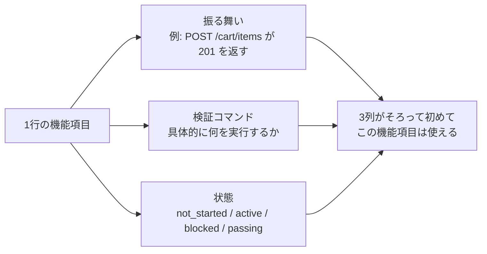
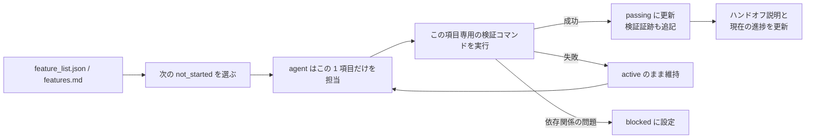

[英語版 →](../../../en/lectures/lecture-08-why-feature-lists-are-harness-primitives/)

> 本文のコード例：[code/](https://github.com/walkinglabs/learn-harness-engineering/blob/main/docs/zh/lectures/lecture-08-why-feature-lists-are-harness-primitives/code/)
> 実践演習：[Project 04. 実行フィードバックで agent の振る舞いを修正する](./../../projects/project-04-incremental-indexing/index.md)

# 第8講. 機能リストで agent が何をすべきかを制約する

あなたが agent に EC サイトを作らせたとします。ひと通り作業が終わると、agent は「完了しました」と報告してきます。ところがコードを確認すると、ユーザー認証はあるのに、カートの決済ボタンを押しても何も起きず、支払いフローもつながっていません。問題は、あなたが「完了」の基準を一度も明示していなかったことです。そのため agent は自分なりの基準、つまり「かなりの量のコードを書いたし、見た目もそれっぽい」を採用してしまったのです。

機能リスト（feature list）は、多くの人にとっては単なる備忘録です。書いておけば忘れない、書き終えたら脇に置く。それで十分だと思われがちです。しかし harness の世界では、機能リストは人間向けのメモではなく、harness 全体の背骨です。スケジューラはこれを見てタスクを選び、バリデータはこれを見て完了を判定し、ハンドオフ機能はこれを見てレポートを生成します。背骨が折れれば、全身は動きません。

Anthropic と OpenAI はどちらも、**成果物は外部化しなければならない**と強調しています。機能の状態は、リポジトリ内にある機械可読なファイルとして保持しなければならず、会話内の非構造化な説明で済ませてはいけません。

## Agent は「完了」の意味を知らない

Claude Code も Codex も、あなたが思い描く「完了」の意味を自動では理解しません。あなたが「カート機能を追加して」と言ったとき、モデルは「Cart コンポーネントと addToCart メソッドを書けばよい」と解釈するかもしれません。しかし、あなたの意図は「ユーザーが商品閲覧から注文・支払いまでの流れを最後まで完了できるようにする」ことです。

この認識のずれは、機能リストがない限り残り続けます。agent は暗黙の基準で完了を判断します。たいていは「コードに目立つ構文エラーがない」程度です。一方で、あなたが必要としているのはエンドツーエンドの動作検証です。友人に買い物を頼んで「果物を買ってきて」と言ったら、レモンを一袋持って帰ってきた、という話に似ています。相手が考えた果物と、あなたが求めた果物は同じではありません。

よくある進捗記録を見てみましょう。

```
ユーザー認証を実装、カートはほぼ完了、あとは支払い
```

新しい agent セッションがこの記録を見て、次の問いに答えられるでしょうか。「ほぼ完了」とは具体的に何を指すのか。カートはどのテストに通っているのか。支払いのブロッカーは何か。答えはすべて「わかりません」です。体調不良を医師に「腹痛です。最近はまあまあです」とだけ伝えるようなもので、そこからどんな処方が出せるでしょうか。

結果として、新しいセッションはプロジェクト状態の推測にまとまった時間を費やし、最後には完了済みの機能を再実装してしまうことがあります。Anthropic の公開事例でも、progress file と git history を使って次の agent が状態を素早く理解できるようにする設計が紹介されています。

## 機能状態機械





## コア概念

- **機能リストは harness の原語**です。これは「あると便利な計画ツール」ではなく、他のすべての harness コンポーネントが依存する基盤データ構造です。データベースのテーブル定義のようなもので、「主キーを省いてみようか」とは言えません。省いた瞬間にシステム全体が崩れます。
- **三つ組の構造**です。各機能項目は `(振る舞いの説明, 検証コマンド, 現在の状態)` の三つ組で成り立ちます。どれか1つでも欠ければ、その機能項目は不完全です。振る舞いの説明は agent に何をするかを伝え、検証コマンドは完了の判定方法を伝え、状態は今どこにいるかを示します。
- **状態機械モデル**です。各機能項目には `not_started`、`active`、`blocked`、`passing` の4状態があります。状態遷移を制御するのは harness であり、agent が好きに書き換えられるものではありません。
- **passing に到達するには検証を通す必要がある**というゲートがあります。機能が `active` から `passing` に変わる唯一の方法は、検証コマンドが成功することです。これは不可逆です。`passing` になったものを後から巻き戻すことはできません。試験に合格したら合格は合格であって、あとから点数に戻せないのと同じです。
- **単一の正本**です。プロジェクト内の「何をすべきか」に関する情報は、すべて1つの機能リストから派生しなければなりません。機能リストと会話記録が食い違うような状態は許されません。
- **逆向きの圧力**です。まだ通過していない機能項目の数が、そのまま harness が agent にかけている圧力になります。圧力がゼロになれば、プロジェクトは完了です。

## なぜ機能リストは「原語」である必要があるのか

ドキュメントは人間のためのものですが、原語はシステムのためのものです。ドキュメントは無視されることがありますが、原語は迂回できません。

これは、データベースのトリガー制約とアプリケーション層のチェックロジックを比べると分かりやすいです。前者はデータベースエンジンによって強制され、どんな SQL でもすり抜けられません。後者はアプリケーションコードの正しさに依存するため、意図せず迂回されることがあります。harness の原語としての機能リストは、データベースレベルの制約に相当します。agent はこれを迂回できません。

具体的には、機能リストは次の4つの harness コンポーネントに役立ちます。

1. **スケジューラ**: 状態を読み、次の `not_started` の機能を選びます。工場の生産計画システムのようなもので、受注を見てはじめて次に何をすべきかが分かります。
2. **バリデータ**: 検証コマンドを実行し、状態遷移を許可してよいか判定します。品質検査のようなもので、本人が合格と言っても合格にはならず、検査に通る必要があります。
3. **ハンドオフレポーター**: 機能リストから会話の引き継ぎ要約を自動生成します。交代時に自動で出てくる引き継ぎ表のようなもので、手書きは不要です。
4. **進捗トラッカー**: 各状態の分布を集計し、プロジェクトの健全性指標を提供します。ダッシュボードのようなもので、プロジェクトがどこまで進んでいるかを一目で把握できます。

## どう作るか

### 1. 最小限の機能リスト形式を定義する

複雑なシステムは不要です。構造化された Markdown または JSON ファイルが1つあれば十分です。重要なのは、各項目に三つ組が必要だということです。

```json
{
  "id": "F03",
  "behavior": "POST /cart/items with {product_id, quantity} returns 201",
  "verification": "curl -X POST http://localhost:3000/api/cart/items -H 'Content-Type: application/json' -d '{\"product_id\":1,\"quantity\":2}' | jq .status == 201",
  "state": "passing",
  "evidence": "commit abc123, test output log"
}
```

### 2. 状態遷移は harness に管理させる

agent が状態を直接 `passing` に変更してはいけません。できるのは検証リクエストを送ることだけです。harness が検証コマンドを実行し、その結果に基づいて状態遷移を許可するかどうかを決めます。これが「passing へのゲート」です。試験に受かったと言い張るのではなく、成績表で確認する仕組みです。

### 3. CLAUDE.md にルールを書く

```
## 機能リストのルール
- 機能リストファイル: /docs/features.md
- 一度に有効化するのは 1 つの機能項目だけ
- 機能項目は検証コマンドに通過して初めて passing とする
- 機能リストの状態は変更しないこと。検証スクリプトが自動更新する
```

### 4. 粒度を合わせる

各機能項目は「1回のセッションで終えられる」範囲にするべきです。粗すぎると終わりませんし、細かすぎると管理コストが増えます。「ユーザーが商品をカートに追加できる」はちょうどよい粒度です。「カートを実装する」は粗すぎますし、「Cart モデルの name フィールドを作る」は細かすぎます。ステーキを切るのと同じで、丸ごとでは食べられませんし、細かくしすぎても扱いづらいです。

## 実例

EC プラットフォームの開発タスクに、10 個の機能項目があるとします。2つの追跡方法を比べてみましょう。

**メモ帳方式**: agent が非構造化メモで進捗を記録します。3セッション後には、メモが「ユーザー認証と商品一覧を実装、カートはほぼ完了だがバグあり、支払いは未着手」のような状態になります。新しいセッションは状態推測に20分かかり、最終的に完了済みの機能を再実装してしまいます。買い物リストに「牛乳、パン、あと何だっけ」と書いたままスーパーに行くようなもので、結局何を買うのか分かりません。

**背骨方式**: 各機能項目に明確な状態と検証コマンドがあります。新しいセッションが機能リストを読むと、3分以内に F01-F05 は `passing`、F06 は `active`（作業中）、F07-F10 は `not_started` だと分かります。そのまま F06 から続行でき、重複作業はゼロです。

この比較で重要なのは、構造化された機能リストでは完了条件と現在状態が機械可読に残るため、自由形式の記録よりも「次に何をやるべきか」「何が完了済みか」を判断しやすいことです。

## 重要ポイント

- **機能リストは harness の背骨**であり、人間向けの備忘録ではありません。スケジューラ、バリデータ、ハンドオフ機能はすべてこれに依存します。
- **各機能項目には三つ組が必要**です。振る舞いの説明 + 検証コマンド + 現在の状態。このうち1つでも欠けると不完全です。3本足の椅子から1本足を抜くようなものです。
- **状態遷移は harness が制御**し、agent が自分で状態を書き換えることはできません。検証を通すことが、唯一の昇格ルートです。
- **機能リストはプロジェクトの単一の正本**です。「何をすべきか」に関する情報はすべてここから派生します。
- **粒度は「1回のセッションで終えられる」範囲に収めます**。粗すぎると終わらず、細かすぎると管理しきれません。

## 参考文献

- [Building Effective Agents - Anthropic](https://www.anthropic.com/research/building-effective-agents) — 機能リストを使って早すぎる完了宣言や scope drift を減らす方法を示しています
- [Harness Engineering - OpenAI](https://openai.com/index/harness-engineering/) — 「成果物を外部化する」という原則を強調しています
- [Design by Contract - Bertrand Meyer](https://www.goodreads.com/book/show/130439.Object_Oriented_Software_Construction) — 契約による設計原則であり、機能リストの理論的基盤です
- [The Practical Test Pyramid - Martin Fowler](https://martinfowler.com/articles/practical-test-pyramid.html) — テストピラミッドとユーザー視点の acceptance tests の実践

## 演習

1. **機能リスト設計**: 最小限の機能リスト用 JSON schema を定義してください。含める項目は、id、振る舞いの説明、検証コマンド、現在の状態、証跡参照です。それを使って、5つの機能を持つ実際のプロジェクトを記述してください。

2. **検証の厳格さの比較**: 3つの機能を選び、それぞれに「ゆるい」検証（例: 「コードに構文エラーがない」）と「厳密な」検証（例: 「エンドツーエンドテストに通る」）を設計してください。2種類の検証における偽陽性率を比較してください。

3. **単一ソース原則の監査**: 既存の agent プロジェクトを監査し、機能リストと矛盾するスコープ情報がないか確認してください（会話中の暗黙要件、コード内の TODO コメントなど）。すべての情報を機能リストへ統一するための案を設計してください。
