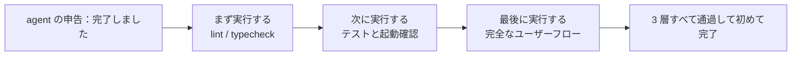
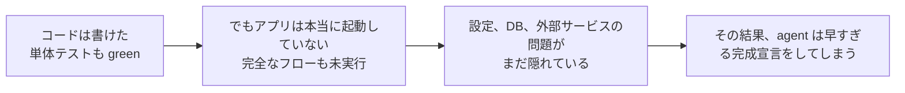

[英語版 →](../../../en/lectures/lecture-09-why-agents-declare-victory-too-early/)

> 本文のコード例：[code/](https://github.com/walkinglabs/learn-harness-engineering/blob/main/docs/zh/lectures/lecture-09-why-agents-declare-victory-too-early/code/)
> 実践演習：[Project 05. agent に自分の作業が正しいか自分で確認させる](./../../projects/project-05-grounded-qa-verification/index.md)

# 第9講. agent が完了を早まって宣言するのを防ぐ

agent に「パスワードリセット」機能を実装させたとします。データベース schema を変更し、API エンドポイントを書き、メールテンプレートを追加し、単体テストも実行しました。しかも全部通りました。そこで agent は自信満々に「完了しました」と言います。ところが実際に動かしてみると、パスワードリセットのリンクは送れないし（メールサービスの設定がない）、データベースの migration は途中で失敗するし（schema が不一致）、E2E フローは一度も通していないことが分かります。

この感覚は、きっと見覚えがあるはずです。試験で答案をびっしり埋めて、満足げに真っ先に提出したのに、結果は不合格だった。答案が埋まっていることと、正しく解けていることは別です。

これは偶然ではありません。Guo らが 2017 年の ICML で示した古典的な論文は、**現代のニューラルネットワークは体系的に過信する**ことを証明しています。つまり、モデルが自分で申告する確信度は、実際の正解率よりもかなり高くなりがちです。AI コーディング agent も同じです。本人は「できた」と感じていても、実際にはほど遠いことがあります。harness は、agent の「感覚」ではなく、外部化された実行ベースの検証でそれを置き換えなければなりません。

## 滑り台効果

完了の早すぎる宣言は、たいてい同じパターンをたどります。コードは一見それらしく見える。構文は正しいし、ロジックも妥当に見えるし、静的チェックにも目立つエラーはない。でも harness が完全な実行検証を強制していないと、agent は実際の実行を飛ばしたり、一部のテストだけを回したりします。単体テストは通したが、統合テストは飛ばした。テストは回したが、カバレッジは確認していない。最後に「コードは問題なさそうだ」が、そのまま「機能は完成した」の証拠として扱われてしまう。そこで提出です。

この過程では、各段階で情報が失われています。タスク仕様からコード実装へ、さらに実行時の挙動へと移るたびにズレが入りうるうえ、検証を飛ばすたびに情報の非対称性はさらに大きくなります。

## 3 層の終了チェック





## 核心概念

- **完了の早すぎる宣言**: agent がタスク完了を断言しても、実際には満たされていない正しさの要件が残っている状態。核心の問題は、agent がコードレベルの局所的な確信だけで判断してしまい、システム全体の正しさには全体的な検証が必要だという点です。
- **確信度のキャリブレーションずれ**: agent の自己申告の完了確信と、実際の完成品質との系統的な差。複雑な複数ファイルのタスクでは、このずれは明確に正方向に出ます。つまり agent は、実際以上に自信満々です。試験後に自己採点すると点が高めになりがちな学生と同じです。
- **終了基準**: harness に定義された、明確で実行可能な判定条件の集合です。agent はすべての条件を満たして初めて完了を宣言できます。「完了」は主観ではなく客観的な判定に変わります。
- **検証-確認の 2 段ゲート**: 第 1 層の検証は「コードが指定された挙動を正しく実装しているか」を確認し、第 2 層の確認は「システム全体の挙動がエンドツーエンド要件を満たしているか」を確認します。2 層とも通過して初めて完了です。
- **実行時フィードバック信号**: プログラムの実行から得られるログ、プロセス状態、ヘルスチェックなどです。これが harness が完了品質を判定する客観的な土台になります。
- **完了優先順位の制約**: まず機能の正しさを検証し、次に性能、最後に見た目やスタイルを扱います。核心機能の検証が通るまでは、リファクタリングをしてはいけません。

## 単体テスト合格 = タスク完了 ではない

これは最もよくある罠であり、しかも最も危険なものの 1 つです。agent はコードを書き、単体テストを回し、すべて green にしてから「できました」と言います。しかし単体テストの設計思想は、被テスト単位を分離し、依存をモックすることです。つまり、コンポーネントをまたぐ問題は検出できません。

**インターフェース不一致**: レンダラープロセスが preload スクリプトに渡すファイルパスは相対パスなのに、preload スクリプトは絶対パスを期待している。双方の単体テストはそれぞれ mock を使っており、どちらも通ります。E2E を実行して初めて問題が見つかります。各メンバーが個別には完璧に練習していても、合奏すると調律が合っていないと分かるバンドのようなものです。

**状態伝播の誤り**: データベース migration でテーブル構造を変えたのに、ORM のキャッシュ層には古い構造のキャッシュエントリが残っている。単体テストは毎回まっさらな mock 環境で走るため、このような層をまたぐ状態不整合は表に出ません。

**環境依存性**: テスト環境では（すべて mock のため）正しく動くのに、本番環境では設定差、ネットワーク遅延、サービス停止などで失敗する。リハーサルではうまく歌えていたのに、本番では PA 機材が壊れたようなものです。

### 「ついでのリファクタリング」は完了判定の毒

Claude Code によくある挙動パターンは、核心機能の検証がまだ終わっていないのに、コードのリファクタリングや性能改善、スタイルの整備を始めてしまうことです。Knuth の「過早最適化は諸悪の根源」という言葉は、agent の文脈では新しい意味を持ちます。リファクタリングは、検証済みと未検証の境界を変えてしまい、これまで暗黙に正しかったコードパスを壊すかもしれません。数学の大問がまだ終わっていないのに、前の選択問題の解答をもう一度きれいに書き直すようなものです。時間の無駄なうえ、書き間違える可能性もあります。

### 自己評価にある体系的な偏り

Anthropic が 2026 年の研究で見つけた、より深い失敗パターンがあります。**agent に自分の作業を評価させると、人間の観察者が明らかに不十分だと考える品質であっても、体系的に好意的に評価しすぎる**のです。これは学生に自分の答案を自分で採点させるようなもので、自分の答えにはどうしても甘くなります。

この問題は、デザインの美しさのような主観的タスクで特に深刻です。「レイアウトは洗練されているか」は判断問題であり、agent は高い確率で肯定寄りに倒れます。検証可能な結果があるタスクでさえ、agent は判断ミスのせいで性能を落とします。

解決策は agent を「もっと客観的にする」ことではありません。同じモデルが生成も評価も両方担当すると、自分に甘くなる方向へ内在的に引っ張られるからです。**解決策は「作業する人」と「チェックする人」を分けることです。** 試験で学生に自分の答案を自分で採点させてはいけないのと同じで、独立した採点者が必要です。

独立した評価用 agent を、あえて「厳しめ」に調整しておくほうが、生成する agent に自己評価させるよりずっと効果的です。Anthropic の実験データは次のとおりです。

| 構成 | 実行時間 | コスト | 核心機能は使えるか |
|------|---------|------|---------------|
| 単独 agent の素の実行 | 20 分 | $9 | いいえ（ゲーム内オブジェクトが入力に反応しない） |
| 3 agent（planner + generator + evaluator） | 6 時間 | $200 | はい（ゲームを普通に遊べる） |

これは同じモデル（Opus 4.5）、同じプロンプト（「2D のレトロゲームエディタを作る」）です。違いは harness だけです。「裸で走らせる」か、「planner が要件を展開し、generator が機能ごとに実装し、evaluator が Playwright で実際にクリックしてテストする」かの違いです。

> 出典：[Anthropic: Harness design for long-running application development](https://www.anthropic.com/engineering/harness-design-long-running-apps)

## どうやって早すぎる提出を防ぐか

### 1. 終了判定を外部化する

完了判定は agent 自身にやらせるべきではありません。harness が独立して終了検証を行い、入力にするのは agent の確信度ではなく、実行時のシグナルです。CLAUDE.md には次のように明記します。

```
## 完了の定義
- 機能完了 = エンドツーエンド検証を通過した状態であり、「コードを書き終えた」ことではない
- 必ず実行する検証レベル:
  1. 単体テストが通る
  2. 統合テストが通る
  3. エンドツーエンドのフロー検証が通る
- 第 1 層を通過していないなら、第 2 層に進んではいけない
- 第 2 層を通過していないなら、第 3 層に進んではいけない
```

### 2. 3 層の終了検証を組み立てる

- **第 1 層: 構文と静的解析**。コストは最小で、得られる情報も最小ですが、必ず通す必要があります。最低限の確認です。字を間違えていないことを確認してから、先に進みます。
- **第 2 層: 実行時挙動の検証**。テストの実行、アプリの起動確認、重要経路の検証です。これが核心となる完了証拠です。書けたことだけでなく、実際に動くことが必要です。
- **第 3 層: システムレベルの確認**。E2E テスト、統合検証、ユーザーシナリオのシミュレーションです。早すぎる宣言を防ぐ最後の防壁です。動くだけでなく、正しく動かなければなりません。

### 3. agent のための「赤ペンの注釈」を用意する

OpenAI は Codex の実践で、かなり効果の高いパターンを提案しています。**agent に出すエラーメッセージには、修正方法も含める**ことです。採点者のように大きなバツだけを付けるのではなく、良い先生のように「ここをどう直せばよいか」を横に書きます。`"Test failed"` とだけ返すのではなく、`"Test failed: POST /api/reset-password returned 500. Check that the email service config exists in environment variables. The template file should be at templates/reset-email.html."` のように、具体的で実行可能なフィードバックを与えると、agent は人間の介入なしに自己修正できます。

### 4. 実行時シグナルを拾う

有効な実行時シグナルには次のようなものがあります。
- アプリは正常に起動し、ready 状態に達しているか？
- 重要な機能経路は実行時に成功しているか？
- データベース書き込みやファイル操作などの副作用は正しいか？
- 一時リソースは片付けられているか？

## 実際の例

**タスク**: ユーザーのパスワードリセット機能を実装する。データベース操作、メール送信、API エンドポイントの変更が含まれる。

**早すぎる提出の流れ**: agent がデータベース schema を変更し、API エンドポイントを書き、メールテンプレートを追加し、単体テストを実行して通し、完了を宣言する。答案はびっしり埋まっています。

**実際の減点要因**: (1) E2E フローを試していないため、リセットリンクの実送信と検証が未確認だった。(2) データベース migration が途中まで実行されたあとに失敗し、schema が不整合になった。(3) 対象環境でメールサービス設定が欠けていた。

**harness の介入**: 終了検証を強制実行することで、(1) アプリ全体を起動してリセットエンドポイントにアクセス可能か確認し、(2) 完全なリセットフローを実行し、(3) データベース状態の一貫性を確認します。欠陥はすべて同じセッション内で見つかり、後続修正コストを 5 倍から 10 倍ほど節約できました。独立した採点者が、本当の問題を指摘したわけです。

## 重要ポイント

- **agent は体系的に過信する**。確信度のキャリブレーションずれは客観的に存在します。答案が埋まっていても、正解とは限りません。
- **完了判定は外部化しなければならない**。harness が独立して検証し、agent の「感覚」は信用しません。学生に自分の答案を採点させてはいけません。
- **3 層のチェックは 1 つも省けない**。構文通過、挙動通過、システム通過の順に積み上げます。
- **エラーメッセージは良い先生の赤ペン注釈のようにする**。具体的な修正手順を含め、agent が自力で直せるようにします。
- **核心機能の検証が通るまでリファクタリングしてはいけない**。完了優先順位の制約は、過早最適化を防ぐ鍵です。

## 参考文献

- [On Calibration of Modern Neural Networks - Guo et al.](https://arxiv.org/abs/1706.04599) — 現代の深層ネットワークが体系的に過信することを示した論文
- [Building Effective Agents - Anthropic](https://www.anthropic.com/research/building-effective-agents) — 完了判定における実行時証拠の重要性
- [Harness Engineering - OpenAI](https://openai.com/index/harness-engineering/) — 早すぎる完了宣言は agent の主要な失敗モードの 1 つ
- [The Art of Software Testing - Myers](https://www.goodreads.com/book/show/137543.The_Art_of_Software_Testing) — テスト手法の階層と有効性に関する古典的な参考書

## 演習

1. **終了検証関数の設計**: データベース migration と API 変更を含むタスクについて、完全な終了検証を設計してください。必要な実行時シグナルと、それぞれのシグナルの合否基準を列挙してください。実際のタスクで実行し、どの隠れた問題を見つけたか記録してください。

2. **キャリブレーションずれの測定**: 種類の異なる 10 個のコーディングタスクを選び、agent の自己申告による完了確信と、実際の完成品質を記録してください。ずれの値を計算し、それとタスクの複雑さとの関係を分析してください。

3. **多層防御の実験**: 同じタスク群に対して 3 つの構成を試してください。(a) 静的解析のみ、(b) 単体テストを追加、(c) 完全な 3 層検証。早すぎる完了宣言の割合と、未検出欠陥の数を比較してください。
