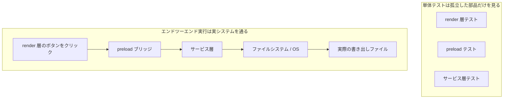
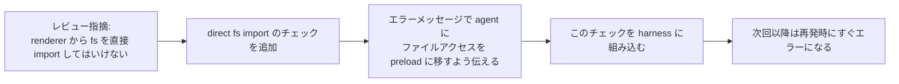

[英語版 →](../../../en/lectures/lecture-10-why-end-to-end-testing-changes-results/)

> 本講のコード例：[code/](https://github.com/walkinglabs/learn-harness-engineering/blob/main/docs/zh/lectures/lecture-10-why-end-to-end-testing-changes-results/code/)
> 実践演習：[Project 05. agent に自分の出力を自分で検証させる](./../../projects/project-05-grounded-qa-verification/index.md)

# 第10講. エンドツーエンドテストは結果を変える

agent に Electron アプリのファイル書き出し機能を追加させたとします。render プロセスのコンポーネント、preload スクリプト、サービス層ロジックを書かせ、各コンポーネントの単体テストもすべて通ったとします。agent は「完了しました」と報告します。ところが実際に書き出しボタンを押してみると、ファイルパスの形式が合わず、進捗バーは反応せず、大きなファイルを書き出すとメモリリークが発生しました。5 つのコンポーネント境界に不具合があったのに、単体テストは 1 つも見つけられなかったのです。

これは合唱団のリハーサルに似ています。各パートは単独で歌うと完璧なのに、合わせてみるとソプラノがバスより半拍早く、伴奏の調が主旋律と半音ずれている。各部分はそれぞれ「正しい」のに、全体としては音が外れているのです。

テストピラミッドが示しているのは、単体テストを大量に用意することは土台として重要だが、それだけで止まるとコンポーネント間の相互作用に起因する問題を体系的に取りこぼす、ということです。AI コーディング agent にとっては、この問題はさらに深刻です。agent は最速のテストだけを実行して、完了を宣言しがちだからです。**エンドツーエンドテストは、単体テストや統合テストでは見えにくいシステム全体の不具合をあぶり出します。ただし、どのテスト層も不具合が存在しないことを証明することはできません。**

## 単体テストの盲点

単体テストの設計思想は隔離です。依存を mock 化し、対象の単位だけに集中します。この考え方は単体テストを高速かつ正確にしますが、同時に体系的な盲点も生みます。合唱のリハーサルで、各パートがイヤホンで伴奏を聴きながら歌っているようなものです。聞いている限りは問題なさそうでも、実際に合わせると問題が見えてきます。

**インターフェースの不一致**: render プロセスが preload スクリプトに渡すファイルパスは相対パスなのに、preload スクリプトは絶対パスを期待している。両者の単体テストはどちらも mock を使っているため通過する。実際に end-to-end でつないだときだけ問題が見つかる。ちょうど、2 つの声部がそれぞれ練習しているときはリズムに問題がないように見えても、合わせると一方が 4/4 拍、もう一方が 3/4 拍で歌っていたと気づくようなものです。

**状態伝播の誤り**: データベースのマイグレーションでテーブル構造を変えたのに、ORM のキャッシュ層が古い構造のキャッシュエントリを持ち続けている。単体テストは毎回まっさらな mock 環境で動くため、こうした層をまたいだ状態の不整合は見えません。曲の歌詞を差し替えたのに、誰かが旧版を歌い続けているようなものです。

**リソースのライフサイクル問題**: ファイルハンドル、データベース接続、ネットワークソケットの確保と解放は複数のコンポーネントにまたがります。単体テストは各テストごとに独立したリソースを生成して破棄するため、リソース競合やリークを露呈しません。リハーサルでは各パートが順番にマイクを使えるのに、本番では全パートが一斉に上がってくるので、マイクが足りなくなるようなものです。

**環境依存性**: コードはテスト環境では（一切 mock された状態で）正しく動いても、本番環境では設定差、ネットワーク遅延、サービス停止で失敗することがあります。リハーサル室ではうまく歌えていたのに、屋外フェスでは風でマイクがハウリングして一気に崩れるようなものです。

## エンドツーエンドテストは結果だけでなく振る舞いも変える

多くの人が見落としている点があります。agent が自分の仕事にエンドツーエンドテストが課されると知ると、コーディング時の振る舞いが変わるのです。

1. **コンポーネント間の相互作用を考える**: コードを書くときに「このインターフェースは上流とどうつながるのか」を考えるようになり、単一関数だけに意識が閉じなくなります。最終的に一緒に歌うと分かっていれば、練習中も他のパートの音を聴くようになるのと同じです。
2. **アーキテクチャの境界を尊重する**: アーキテクチャ制約があるシステムでは、エンドツーエンドテストが agent に境界ルールの順守を強制します。楽譜に「ここはクレッシェンド」と書いてあれば、それに従うしかないのと同じです。
3. **エラー経路を扱う**: エンドツーエンドテストにはたいてい障害シナリオが含まれるため、agent は例外処理まで考えるようになります。リハーサルで「突然マイクが無音になった」状況を想定しておけば、どう対処するか分かるのと同じです。

## テストピラミッドとレビュー・フィードバックの改善





OpenAI は Codex のエンジニアリング実践で、**agent 向けのエラーメッセージには修正手順を含めるべきだ**と強調しています。`"Direct filesystem access in renderer"` とだけ書くのではなく、`"Direct filesystem access in renderer. All file operations must go through the preload bridge. Move this call to preload/file-ops.ts and invoke it via window.api."` と書く。これにより、アーキテクチャルールは自動修正のループになります。合唱のリハーサルでも、指揮者がただ「間違っている」と言うのではなく、「ここは半拍早い。第 32 小節で入る前に、女低音のリズムを聴いて」と具体的に伝えるのと同じです。

## 核心概念

- **コンポーネント境界の欠陥**: コンポーネント A と B はそれぞれ単体テストに通るのに、その相互作用が不正な振る舞いを生む。これはエンドツーエンドテストが最も得意とする問題です。合唱で各パートは個別に正しいのに、合わせると音程がずれるようなものです。
- **テストの十分性の組み合わせ**: 単体テスト、統合テスト、エンドツーエンドテストは、それぞれ異なる種類の欠陥を見つけるのが得意です。層が高いほど実システムの振る舞いに近づきますが、下位のテストを置き換えることはできません。
- **アーキテクチャ境界の実行ルール**: アーキテクチャ文書に書かれたルール（たとえば「render プロセスはファイルシステムに直接アクセスできない」）を、実行可能な自動チェックに変えることです。「紙に書いてある」状態から「CI で実行される」状態へ移します。
- **レビュー・フィードバックの改善**: 繰り返し出るコードレビュー指摘を自動テストへ変換します。重複する問題が見つかるたびに 1 つルールを増やし、harness を自動的に強化します。合唱のリハーサルで指揮者がよくあるミスを練習曲にしたようなものです。次に同じミスをすると、指揮者が何も言わなくても練習曲そのものが問題をあぶり出します。
- **agent 向けのエラーメッセージ**: 失敗メッセージは「何が起きたか」だけでなく、agent に「どう直すか」まで伝える必要があります。これでテスト失敗が自己修正のフィードバックループになります。

## やり方

### 0. 先にアーキテクチャ境界を決めてから、エンドツーエンドテストを書く

エンドツーエンドテストの前提は、システムに明確な境界があることです。アーキテクチャが曖昧なままでは、エンドツーエンドテストは「この塊が全体として動く」ことしか示せず、設計意図に反している箇所は分かりません。合唱団でも、パート分けが曖昧なら、どれだけリハーサルしても混ざった歌にしかなりません。

OpenAI の経験では、**agent が生成するコードベースでは、アーキテクチャ制約は初日から入れるべき前提条件であり、チームが大きくなってから考えるものではありません。** 理由は単純です。agent はリポジトリにある既存パターンを、その良し悪しにかかわらず再現してしまうからです。アーキテクチャ制約がなければ、agent は会話のたびに偏差を積み増していきます。

OpenAI は「層別ドメインアーキテクチャ」を採用しています。各業務領域は `Types` → `Config` → `Repo` → `Service` → `Runtime` → `UI` の固定層に分割されます。依存方向は厳密に前向きで、ドメインをまたぐ関心事は明示的な `Providers` インターフェースを通じて入ります。それ以外の依存は禁止され、独自 lint で機械的に強制されます。

重要な原則は、**不変条件を実行し、実装を細かく管理しすぎない** ことです。たとえば「データは境界で解析する」とは求めても、どのライブラリを使うかまでは指定しません。エラーメッセージには修正手順を含めるべきです。「違反した」とだけ言うのではなく、agent にどう直すかを示します。

> 出典: [OpenAI: Harness engineering: leveraging Codex in an agent-first world](https://openai.com/index/harness-engineering/)

### 1. harness にはエンドツーエンド層を含める

検証フローの中で、コンポーネントをまたぐ変更を含むタスクでは、エンドツーエンドテストの通過を完了条件として明示します。

```
## 検証層
- 層 1: 単体テスト（必須通過）
- 層 2: 統合テスト（必須通過）
- 層 3: エンドツーエンドテスト（コンポーネントをまたぐ変更時は必須通過）
- 必須層を飛ばしたタスク = 未完了
```

### 2. アーキテクチャルールを実行可能なチェックに変える

すべてのアーキテクチャ制約には、それに対応するテストまたは lint ルールが必要です。

```bash
# render プロセスが Node.js API を直接呼んでいないか確認する
grep -r "require('fs')" src/renderer/ && exit 1 || echo "OK: no direct fs access in renderer"
```

### 3. agent 向けのエラーメッセージを設計する

失敗メッセージには 3 要素が必要です。何が問題か、なぜ問題か、どう直すかです。

```
ERROR: Found direct import of 'fs' in src/renderer/App.tsx:12
WHY: Renderer process has no access to Node.js APIs for security
FIX: Move file operations to src/preload/file-ops.ts and call via window.api.readFile()
```

### 4. レビュー・フィードバック改善の流れを作る

コードレビューで新しい種類の agent の誤りが見つかるたびに、それを自動チェックに変えます。1 か月後には、harness は月初よりかなり強くなっているはずです。合唱団のリハーサルノートのように、毎回見つかった問題を記録して、次のリハーサル前にその点を確認します。繰り返すうちに、よくあるミスは減り、音楽はよりまとまっていきます。

## 実例

**タスク**: Electron アプリでファイル書き出し機能を実装する。render プロセスの UI、preload スクリプトのファイルシステム代理、サービス層のデータ変換が関わる。

**各パートを個別に歌う場合（単体テストは通る）**: render コンポーネントのテスト（通過、ファイル操作を mock）、preload スクリプトのテスト（通過、ファイルシステムを mock）、サービス層テスト（通過、データソースを mock）。agent は完了を宣言する。

**合唱として合わせる場合（エンドツーエンドテストで露見した欠陥）**:

| 欠陥 | 説明 | 単体テスト | エンドツーエンド |
|------|------|---------|--------|
| インターフェース不一致 | ファイルパスの形式が揃っていない | 検出されない | 検出される |
| 状態伝播 | 書き出し進捗が IPC で UI に戻ってこない | 検出されない | 検出される |
| リソースリーク | 大きなファイルを書き出したときにハンドルが解放されない | 検出されない | 検出される |
| 権限の問題 | パッケージ環境で権限が異なる | 検出されない | 検出される |
| エラー伝播 | サービス層の例外が UI 層まで届かない | 検出されない | 検出される |

5 つの欠陥はすべてエンドツーエンドテストで捕捉され、単体テストは 1 つも見つけられませんでした。代償はテスト時間が 2 秒から 15 秒に増えたことですが、agent の作業フローでは十分許容できます。各パートがどれだけうまく単独で歌えても、完全な合唱リハーサルにはかないません。

## 重要ポイント

- **単体テストはコンポーネント境界の欠陥に体系的に弱い**: 隔離する設計そのものが、相互作用の問題を検出しにくくしているからです。全員が正しく歌っているように見えても、合唱が外れていないとは限りません。
- **エンドツーエンドテストは欠陥を見つけるだけでなく、agent のコーディング振る舞いも変える**: 統合と境界をより意識するようになります。
- **アーキテクチャルールは実行可能でなければならない**: 文書に書いて読んでもらうだけではなく、各コミットで自動チェックされる必要があります。
- **エラーメッセージは agent 向けに設計する**: 「どう直すか」の具体手順を含め、自己修正ループを作ります。
- **レビュー・フィードバック改善は harness を自動的に強くする**: 捕捉した欠陥カテゴリが、そのまま恒久的な防波堤になります。

## 参考文献

- [The Practical Test Pyramid - Martin Fowler](https://martinfowler.com/articles/practical-test-pyramid.html) — テスト層を補完関係として扱う実践的整理
- [Harness Engineering - OpenAI](https://openai.com/index/harness-engineering/) — アーキテクチャ制約を自動実行するエンジニアリング実践
- [Chaos Engineering - Netflix (Basiri et al.)](https://ieeexplore.ieee.org/document/7466237) — 故障を意図的に注入してシステムの耐障害性を検証する手法
- [QuickCheck - Claessen & Hughes](https://www.cs.tufts.edu/~nr/cs257/archive/john-hughes/quick.pdf) — 例示テストと形式検証の中間にある属性ベーステストの手法

## 練習

1. **コンポーネント間欠陥の検出**: 少なくとも 3 つのコンポーネントにまたがる変更タスクを 1 つ選ぶ。まず単体テストだけを実行して結果を記録し、その後エンドツーエンドテストを実行する。追加で見つかった欠陥が、どの種類の層間相互作用の問題かを分析する。

2. **アーキテクチャルールの自動化**: プロジェクト内のアーキテクチャ制約を 1 つ選び、それを実行可能なチェック（agent 向けのエラーメッセージ付き）に変える。harness に組み込み、ベンチマークタスクで効果を検証する。

3. **レビュー・フィードバックの改善**: コードレビュー履歴から繰り返し出てくる指摘の種類を 1 つ見つけ、5 段階の手順で自動チェックに変換する。改善前後で、その種の問題の発生頻度を比較する。
