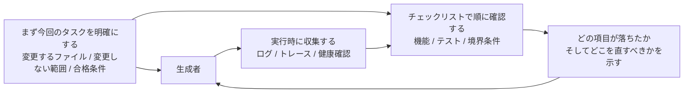

[英語版 →](../../../en/lectures/lecture-11-why-observability-belongs-inside-the-harness/)

> 本文のコード例：[code/](https://github.com/walkinglabs/learn-harness-engineering/blob/main/docs/zh/lectures/lecture-11-why-observability-belongs-inside-the-harness/code/)
> 実践課題：[Project 06. 一式そろった agent 実行環境を構築する](./../../projects/project-06-runtime-observability-and-debugging/index.md)

# 第11講. observability が harness の内側にあるべき理由

agent に仕事を任せると、20 分間動き続けて大量のファイルを変更し、最後に「完了しましたが、テストが 2 件失敗しています」と返ってくることがある。なぜ失敗したのかを尋ねると、「はっきりしません。たぶんタイミングの問題です」と答える。どの重要なパスを変更したのかを聞くと、「コードを見てみます……」と言う。

これは agent の能力不足ではない。harness に計器が載っていないだけだ。計器のない車を運転するところを想像してほしい。速度計も、燃料計も、エンジン警告灯もない。走ることはできても、どれくらいの速さで走っているのか、燃料がどれだけ残っているのか、エンジンが今にも壊れそうかは分からない。どれだけ腕のいい運転者でも、目隠しをしたままでは事故は避けられない。

**observability がなければ、agent は確証のない状態で意思決定し、評価は主観に寄り、再試行は手探りになる。** OpenAI と Anthropic はどちらも、信頼性を「証拠の問題」と捉えている。つまり harness は、次の判断を導ける形で実行時の挙動と評価シグナルを提示しなければならない。

## observability がないと何を失うのか

harness に observability が欠けると、次の 4 つの問題が体系的に起きる。

**「正しい」と「正しそう」を見分けられない**: ある関数はコードレビュー上は完璧に見える。構文は正しく、ロジックも通っている。ところが実行時には境界条件の扱いを誤り、特定の入力で不正な結果を返す。実際の実行経路が期待とずれていることは、実行時トレースでしか分からない。舞台稽古では台詞が完璧でも、本番で照明が当たった瞬間に表情や立ち位置が崩れる俳優のようなものだ。現場を見なければ気づけない。

**評価が占いになる**: 評価基準や受け入れ条件がないと、評価者（人でも agent でも）は暗黙の前提に頼ることになる。同じ出力でも、評価者が違えばまったく違う判定になる。品質評価は再現できない。体操競技に採点基準がないようなものだ。ある審判は優雅だと言い、別の審判は着地が不安定だと言う。いったい何を信じればいいのか。

**再試行が当てずっぽうになる**: agent が失敗の理由を知らないと、再試行の方向もランダムになる。関係ないコードパスを直してしまい、本当の障害原因を見落とすかもしれない。車が左に寄っているのに、メーターがないからタイヤだと決めつけて交換するようなものだ。実際には、問題はハンドルのアライメントかもしれない。こうした盲目的な再試行は、トークンも時間も浪費する。

**セッション引き継ぎ時に情報が断絶する**: 未完了の作業を次のセッションに引き継ぐとき、observability が欠けていると、新しいセッションはゼロから状態を診断し直さなければならない。Anthropic の公開事例でも、progress notes と git log を読ませ、起動時に基本動作を確認することで、前セッションからの状態把握を助けている。交代した運転手が、引き継ぎ記録なしで車に乗り込むようなものだ。

## Claude Code の実例

「planner - generator - evaluator」の 3 役を使う harness で、「アプリにダークモードを追加する」タスクを実行する場面を考えてみよう。

**計器がない場合**: planner の出力は曖昧な説明になる。generator はその曖昧な説明に基づいてダークモードを実装するが、planner の暗黙の期待とは一致しない。evaluator は自分の暗黙基準で却下するが、どこが悪いのか具体的には言えない。「なんとなく違う」というだけだ。generator は曖昧な却下理由をもとに、見当違いの再試行を繰り返し、最後にようやく形になる。

**完全な計器がある場合**: planner はスプリント契約を出す。どのコンポーネントを変更するのか、各コンポーネントの検証基準は何か、除外項目は何か（印刷スタイルは扱わない）を明記する。generator はその契約に従って実装する。実行時の observability は、各コンポーネントのスタイル読み込みと適用の流れを記録する。evaluator は採点基準に沿って各観点を評価し、具体的な証拠を添える。「ボタンのコントラスト比が足りない（WCAG AA 基準は 4.5:1 だが、実測は 2.1:1）」という具合だ。短い反復で高品質な結果を得やすくなる。

効率は 3 倍違う。違いを生んでいるのは observability だけだ。車に計器が載っているかどうか、それだけである。

## 2 層の observability

observability は「ログをたくさん出す」ことではない。2 層あり、どちらも欠かせない。



**実行時 observability**: システム層のシグナル。ログ、トレース、プロセスイベント、健康確認を指す。「システムが何をしたのか」に答える。車でいえば、速度計、燃料計、エンジン温度計だ。

**プロセス observability**: harness の意思決定成果物が見えること。計画、採点基準、受け入れ条件を指す。「なぜこの変更を受け入れるべきなのか」に答える。ナビゲーションのようなもので、今どこにいるかだけでなく、なぜこのルートを通るのかも分かる。

## 重要な概念

- **実行時 observability**: システム層のシグナル。ログ、トレース、プロセスイベント、健康確認を指す。「システムが何をしたのか」に答える。
- **プロセス observability**: harness の意思決定成果物が見えること。計画、採点基準、受け入れ条件を指す。「なぜこの変更を受け入れるべきなのか」に答える。
- **タスクトレース**: タスク開始から完了までの意思決定経路をすべて記録したもの。分散システムのリクエストトレースに似ている。agent の各操作とその文脈が記録される。問題が起きたときに再生できるブラックボックスのようなものだ。
- **スプリント契約**: コーディング開始前に交わす短期の合意。タスク範囲、検証基準、除外項目を明確にする。プロセス observability の中核をなす道具だ。
- **評価採点基準**: 品質評価を主観から証拠ベースの構造化された採点へ変えるもの。同じ出力に対して、評価者ごとの結論を近づける。体操競技の採点基準のようなもので、これがあると 10 人の審判で点差が大きく開かない。
- **2 層の observability**: システム層とプロセス層を同時に設計し、互いを強化すること。実行時シグナルは挙動を説明し、プロセス成果物は意図を説明する。

## なぜ agent だけでは解決できないのか

「agent 自身がログを出せばいいのでは？」と思うかもしれない。だが問題は次の通りだ。

1. **agent は自分が何を知らないか分からない**。自分が記録すべきだと気づいていないシグナルは、そもそも記録しない。油漏れに気づいていないのに燃料計を見に行かないのと同じだ。
2. **ログの形式が揃わない**。セッションごとに形式が違えば、体系的な分析ができない。10 人の運転手がそれぞれ別形式の引き継ぎメモを書いているようなもので、次の人は読めない。
3. **プロセス observability はログでは足りない**。スプリント契約や採点基準は構造化された成果物であり、harness 層の支援が必要だ。print を何行増やしても解決しない。

## 計器の載せ方

### 1. harness に実行時シグナル収集を組み込む

agent 自身のログ出力に頼ってはいけない。harness が自動で次のシグナルを収集するべきだ。

- **アプリケーションのライフサイクル**: 起動、準備完了、実行、終了の各状態
- **機能経路の実行**: 主要な経路の実行記録。入口、チェックポイント、出口を含む
- **データフロー**: コンポーネント間でのデータの流れ
- **リソース利用**: 異常なリソース使用パターン（たとえばメモリが増え続ける）
- **エラーと例外**: エラーメッセージだけでなく、完全なコンテキスト

### 2. スプリント契約を導入する

各タスクの開始前に、generator と evaluator（同一 agent の別呼び出しでもよい）が契約を交わす。施工チームが着工前に結ぶ施工契約のようなものだ。

```markdown
# スプリント契約: ダークモード対応

## 範囲
- テーマ切り替えコンポーネントを変更する
- グローバル CSS 変数を更新する
- ダークモードのテストを追加する

## 検証基準
- 各コンポーネントのビジュアル回帰テストが通る
- 主要な E2E テストが通る
- スタイルのちらつき (FOUC) がない

## 除外項目
- 印刷スタイルは扱わない
- サードパーティ製コンポーネントのダークモード対応は扱わない
```

### 3. 評価採点基準を作る

「良いか悪いか」を定量化された点数に変える。体操競技の採点基準を定めるようなものだ。

```markdown
# 採点基準

| 観点 | A | B | C | D |
|------|---|---|---|---|
| コードの正しさ | すべてのテストが通る | 主要経路が通る | 一部のみ通る | コンパイル失敗 |
| アーキテクチャ適合 | 完全に適合 | 軽微な逸脱 | 明らかな逸脱 | 深刻な違反 |
| テスト網羅 | 主要経路 + 境界条件 | 主要経路のみ | 骨組みのみ | テストなし |
```

### 4. OpenTelemetry で標準化する

各 harness セッションに trace を 1 つ作り、各タスクに span を 1 つ、各検証ステップに子 span を作る。標準属性で重要な情報を付与する。こうすれば、observability データを Jaeger や Zipkin などの標準ツールチェーンと統合できる。

## Anthropic の 3 agent アーキテクチャ実験

Anthropic は 2026 年 3 月に、体系的な harness 実験を公開した。同じタスク（「Web Audio API でブラウザ上の DAW を作る」）を 3 種類のアーキテクチャで実行し、各段階の詳細なデータを記録している。

| Agent と段階 | 時間 | コスト |
|------------|------|------|
| Planner（計画者） | 4.7 分 | $0.46 |
| Build 第 1 ラウンド | 2 時間 7 分 | $71.08 |
| QA 第 1 ラウンド | 8.8 分 | $3.24 |
| Build 第 2 ラウンド | 1 時間 2 分 | $36.89 |
| QA 第 2 ラウンド | 6.8 分 | $3.09 |
| Build 第 3 ラウンド | 10.9 分 | $5.88 |
| QA 第 3 ラウンド | 9.6 分 | $4.06 |
| **合計** | **3 時間 50 分** | **$124.70** |

3 つの agent はそれぞれ役割が異なり、各々が明確な observability の役目を担っている。

**Planner（計画者）**: ユーザーの 1〜4 文程度の要望を受け取り、完全な製品仕様へと拡張する。「大胆にスコープを定めること」が求められ、「詳細な技術実装ではなく、製品コンテキストと高レベルな技術設計に集中すること」が重視される。理由は、planner が早すぎる段階で細かな技術仕様を決めてしまい、それが間違っていた場合、誤りが下流の実装へ連鎖するからだ。よりよいのは、成果物の条件を絞り、実行の過程で agent 自身が道筋を見つけられるようにすることだ。建築家が外観図と構造図だけを描き、レンガの積み方まで指定しないのと同じだ。

**Generator（生成者）**: スプリントごとに機能を実装する。各スプリントの前に、evaluator と sprint 契約を交わす。その機能ブロックが「完了」と言える基準を合意し、その契約に従って実装し、自己評価の後に QA に渡す。感覚ではなく契約で施工する。

**Evaluator（評価者）**: Playwright MCP を使って、実行中のアプリをユーザーのようにクリックし、UI 機能、API エンドポイント、データベース状態を検証する。各スプリントを 4 つの観点で採点する。製品の深さ、機能性、ビジュアルデザイン、コード品質だ。各観点には厳格な閾値があり、どれか 1 つでも満たさなければスプリントは失敗となる。generator は詳細なフィードバックを受けて修正する。検収担当者が検査基準に沿って 1 項目ずつ確認し、基準未達なら差し戻すのと同じだ。

QA 第 1 ラウンドのフィードバック例として、次のようなものがある。「見た目は印象的で、AI 連携も良好だが、コアの DAW 機能のいくつかは見せかけに留まり、操作の深さがない。クリップをドラッグ/移動できず、楽器 UI パネル（シンセのノブ、ドラムパッド）がなく、視覚効果エディタ（EQ カーブ、コンプレッサーのメーター）もない」。これらは些末な問題ではない。DAW を実用にするための中核的な対話だ。つまり、具体的で証拠のあるフィードバックであって、「なんとなく違う」ではない。

Evaluator が最初からここまで優秀だったわけではない。初期版は妥当な問題を見つけても、「とはいえ大したことではない」と自分を納得させ、最終的に作業を承認してしまっていた。調整方法は、evaluator のログを読み、人間の判断と分岐した箇所を見つけ、QA の prompt を更新してその問題を潰していくことだ。こうした開発サイクルを何度か回すうちに、evaluator の採点は妥当になっていった。新任の検収担当者を鍛えるようなものだ。最初は甘すぎるが、事故を何度か見てようやく厳しくなる。

> 出典：[Anthropic: Harness design for long-running application development](https://www.anthropic.com/engineering/harness-design-long-running-apps)

## 重要ポイント

- **observability は harness のアーキテクチャ属性である**。後から付け足す機能ではなく、設計時に組み込むべき中核能力だ。計器はオプション品ではなく、標準装備である。
- **2 層の observability はどちらも必要**。実行時シグナルは「何が起きたか」を説明し、プロセス成果物は「なぜそうしたか」を説明する。速度計とナビゲーションは役割が違う。
- **スプリント契約は事前のすり合わせを前倒しする**。生成者が、評価者が予見可能な理由で即座に却下するものを作ってしまう事態を防ぐ。施工契約は完成後ではなく着工前に結ぶ。
- **採点基準が評価を再現可能にする**。異なる評価者でも同じ出力に対して似た点数を付けられる。採点基準があれば、10 人の審判の点差は大きく開かない。
- **observability の欠如は、セッション冒頭の重複診断を増やす**。

## 参考文献

- [Observability Engineering - Charity Majors](https://www.honeycomb.io/blog/observability-engineering-book) — 現代の observability エンジニアリングの理論と実践の枠組み
- [Dapper - Google (Sigelman et al.)](https://research.google/pubs/pub36356/) — 大規模分散トレーシングの先駆的実践
- [Harness Design - Anthropic](https://www.anthropic.com/engineering/harness-design-long-running-apps) — スプリント契約と評価採点基準の導入
- [Site Reliability Engineering - Google](https://sre.google/sre-book/table-of-contents/) — 本番システムにおける observability の体系的な応用

## 演習

1. **observability のギャップ分析**: 現在の harness を見直し、システム層とプロセス層の observability を評価する。既存のシグナルだけでは見分けられないシステム状態を洗い出し、追加策を提案する。

2. **スプリント契約の実践**: 実際のタスク 1 件についてスプリント契約を書く。agent に契約どおり実行させ、契約なしの場合と比べて効率と品質の差を確認する。

3. **タスクトレースの構築**: 1 つのコード実装タスクにおける agent の各操作をすべて記録する。OpenTelemetry のセマンティック規約を使って注釈を付ける。トレース内の情報ボトルネックを分析し、どのステップの判断が十分なシグナルで支えられていないかを明らかにする。
