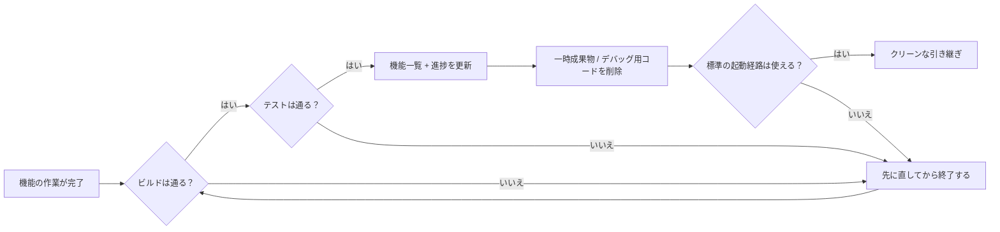
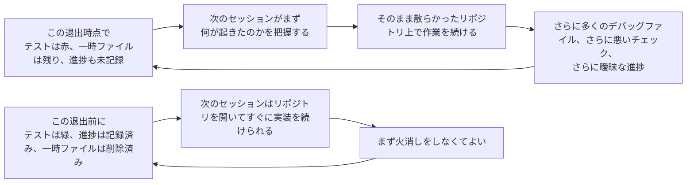

[英語版 →](../../../en/lectures/lecture-12-why-every-session-must-leave-a-clean-state/)

> 本章のコード例：[code/](https://github.com/walkinglabs/learn-harness-engineering/blob/main/docs/zh/lectures/lecture-12-why-every-session-must-leave-a-clean-state/code/)
> 実践演習：[Project 06. 完全な agent 作業環境を構築する](./../../projects/project-06-runtime-observability-and-debugging/index.md)

# 第12講. すべてのセッションは必ずクリーンな状態を残す

あなたの agent は午後いっぱい走り続け、20 個のファイルを変更し、コードをコミットして、セッションを終えました。次の agent セッションが始まると、最初に目に入るのは、ビルド失敗、赤くなったテスト、あちこちに散らばる一時デバッグファイル、更新されていない機能一覧、そしてまったく分からない進捗です。新しいセッションの最初の 30 分は、すべて「前のセッションがいったい何をしていたのか」を把握することに消えていきます。

これは大学の寮のようなものです。ゴミを捨てなければ、次のルームメイトが入ってきてあなたの後始末をしなければなりません。本来は試験勉強をするつもりだったのに、まずはあなたが残した散らかった状態を片付けるために 30 分を使うことになるのです。さらに厄介なのは、片付けが終わるころには勉強する気力まで削られてしまうことです。環境が悪いと気分も悪くなります。

OpenAI と Anthropic はどちらも明確に示しています。**長期的な信頼性は、単発の実行成功ではなく、運用上の規律にかかっている。** 各セッション終了時の状態の質が、次のセッションの効率を直接決めます。

## エントロピー増大がデフォルト

Lehman のソフトウェア進化の法則は、継続的に変化するシステムでは、積極的に管理しなければ複雑さが必ず増していくことを教えています。これは AI コーディング agent にとくに当てはまります。agent はセッションごとに変更を加えるため、終了時に片付けないと技術的負債は指数関数的に積み上がります。寮を掃除しなければ、汚れた服や出前の容器は増え続けるだけで、自然には消えません。

OpenAI は 5 か月にわたる Codex 実験で、**agent はリポジトリ内に既にあるパターンをコピーする。たとえそのパターンが不均一でも、最適でなくても。** と観察しました。時間が経つにつれて、このコピーは必然的にドリフトを生みます。寮の共用スペースと同じです。最初の人が机の上にコップを 1 つ置き、次の人が「もう散らかっているし」とさらに 1 つ置くと、1 週間後には机の上がいっぱいになります。

OpenAI のチームは当初、毎週金曜日の 20% の勤務時間を使って、手作業で「AI 生成の雑多な成果物」を片付けていました。予想どおり、これはスケールしません。寮で毎週 1 回だけ大掃除をしても、残りの 6 日間の散らかりをそのまま我慢するしかないのと同じです。彼らの解決策は次の 3 つです。

1. **「黄金ルール」をリポジトリにコード化する**: たとえば「手書きの場当たり的なヘルパー関数より共有ツールキットを優先する」（不変条件を一元管理する）、「データ構造を YOLO 的に推測しない」（境界を検証するか、型付き SDK に依存する）といったものです。これらの原則は具体的で、機械的で、自動検査できます。
2. **定期的な清掃フローを設ける**: バックグラウンドの Codex タスク群が定期的に偏差をスキャンし、品質スコアを更新し、対象を絞ったリファクタリング PR を開きます。多くは 1 分以内にレビューでき、そのまま自動でマージできます。寮に自動掃除ロボットを入れるようなものです。手を動かさなくても、定期的に片付きます。
3. **人間の感覚を 1 回だけ取り込み、継続的に適用する**: レビューコメント、リファクタリング PR、利用者側のバグは、ドキュメント更新やツールへの直接のコード化に変換されます。ドキュメントだけでは足りないときは、ルールをコードに昇格させます。寮のルールを「口約束」から「ドアに貼ったチェックリスト」に変えるようなものです。

この仕組みはガベージコレクションのようなものです。技術的負債は高金利ローンであり、あとでまとめて返すより、少額を継続して返済するほうがほとんどの場合はうまくいきます。

> 出典：[OpenAI: Harness engineering: leveraging Codex in an agent-first world](https://openai.com/index/harness-engineering/)

## クリーンな状態: 机の上にゴミがないだけでは不十分

クリーンな状態は、単に「コードがビルドできる」という 1 点ではありません。コードがエラーなくビルドできることは最低条件であり、次のセッションが最初にビルドエラーを直すべきではありません。引っ越しでいえば、水道や電気が止まっていないことが前提です。さらに、会話の前から存在していたテストを含め、すべてのテストが通っていなければなりません。セッションには既存機能を壊さない責任があります。そして、それは CI 環境で確認しなければならず、「自分のマシンでは通った」では不十分です。



しかし、これだけでもまだ足りません。現在の進捗は、機械可読な成果物に記録されていなければなりません。つまり、完了済みのサブタスクとその合格基準、進行中でまだ終わっていないサブタスクと現在の状態、未着手のサブタスクです。適切な進捗記録は、セッション開始時の診断を減らします。デバッグログ、一時ファイル、コメントアウトされたコード、TODO マークのような一時成果物はきれいに削除しなければなりません。これらは次のセッションの認知負荷を増やします。標準の起動経路も使える必要があります。次のセッションが、人の手を介さずに作業を始められるでしょうか。環境初期化、コードベースの読み込み、コンテキストの取得、タスク選択。これらの経路は壊してはいけません。



## 主要概念

- **クリーンな状態**: セッション終了時にシステムが 5 つの条件を満たしていること。ビルド成功、テスト成功、進捗記録済み、古い成果物なし、起動経路が利用可能。1 つでも欠ければ「完了」とはみなしません。
- **セッションの完全性**: データベースのトランザクションになぞらえたものです。すべてをコミットしてクリーンな状態を残すか、前の一貫した状態にロールバックするかのどちらかです。中間はありません。
- **品質ドキュメント**: 各モジュールの品質レベルを継続的に記録するアクティブな成果物です。一度きりの評価ではなく、コードベースが強くなっているのか弱くなっているのかを追跡します。
- **清掃ループ**: コードベース内のエントロピーを体系的に減らすことを目的とした、定期的な保守セッションです。緊急対応ではなく通常運用です。寮の毎週の当番表のようなものです。
- **harness の簡素化**: モデル能力が上がるにつれて、もはや不要になった harness コンポーネントを定期的に取り除くことです。今日必要な制約が、3 か月後には余計なコストになっているかもしれません。
- **冪等な清掃**: 何回実行しても同じ結果になる清掃操作です。失敗時の再試行があっても安全であることを保証します。

## 「あとで片付ける」は、永遠に片付けないということ

最もよくある心理的な罠は、「今回は片付ける時間がないから、次回やろう」です。しかし次の agent は、あなたが前回何を残したのか知りません。見えているのは、混乱したコードと不確かな状態だけです。そして「このコードのどこが意図的で、どこが一時的なのか」を推測するために、多くの時間を使うことになります。

さらに悪いことに、各セッションにはそれぞれ固有の目標があります。新しいセッションが来たとき、それがやるべきなのは新機能の実装であって、前のセッションの後始末ではありません。混乱した状態を無視して新しい作業を始め、その混乱の上にさらに混乱を重ねていきます。これはエントロピー増大の正のフィードバックループです。寮が散らかるほど片付けたくなくなり、片付けないほどさらに散らかり、最後には誰も寮に戻りたくなくなります。

この講義では、次のような想定例で差を考えます。

- クリーンアップ戦略なし: 週を追うごとにビルドとテストの失敗が増え、新しいセッションはまず状態復元に時間を使う。
- クリーンアップ戦略あり: 各セッションの終了時にビルド、テスト、進捗、成果物、起動経路を確認し、次のセッションがすぐ作業に入れる状態を保つ。

ここで重要なのは、特定の数値ではなく傾向です。クリーンな終了条件を持たないプロジェクトは、時間の経過とともに「作る時間」より「状態を戻す時間」が増えていきます。

## どうやるか

### 1. クリーンな状態を完了条件に含める

harness では次のように明確に定義します。**セッション完了 = タスクが検証を通過 AND クリーン状態チェックが通過。** どちらか 1 つでも欠ければ、そのセッションは完了とみなしません。CLAUDE.md には次のように書きます。

```
## セッション終了チェックリスト
- [ ] ビルドが通る (npm run build)
- [ ] すべてのテストが通る (npm test)
- [ ] 機能一覧が更新されている
- [ ] デバッグコードの残骸がない (console.log, debugger, TODO)
- [ ] 標準起動経路が使える (npm run dev)
```

### 2. 2 モードのクリーンアップ戦略

2 つのクリーンアップモードを組み合わせます。

**即時クリーンアップ（各セッション終了時）**: 今回のセッションで作成した一時成果物を削除し、機能一覧の状態を更新し、ビルドとテストが通ることを確認します。これは「参照カウント型」のクリーンアップです。使い終わったらすぐ片付けます。食べ終わったらすぐ皿を洗い、翌日まで持ち越しません。

**定期クリーンアップ（週 1 回）**: システム全体をスキャンし、蓄積した構造的問題を処理し、品質ドキュメントを更新し、ベンチマークを実行してドリフトを検出します。これは「トラッキング型」のクリーンアップです。定期的に大掃除をします。

### 3. 品質ドキュメントを維持する

品質ドキュメントは、各モジュールのスコアを継続的に記録するアクティブな成果物です。寮の衛生検査表のようなものです。

```markdown
# 品質ドキュメント

## ユーザー認証モジュール (品質: A)
- 検証済み: はい
- agent が理解しやすい: はい
- テストの安定性: 安定
- アーキテクチャ境界: 適合
- コード規約: 遵守

## 支払いモジュール (品質: C)
- 検証済み: 一部（支払いコールバックが未テスト）
- agent が理解しやすい: 難しい（ロジックが 3 ファイルに分散）
- テストの安定性: 不安定（flaky テストが 2 件）
- アーキテクチャ境界: 逸脱あり
- コード規約: 部分的に遵守
```

新しいセッションはこの文書を読めば、どこを優先すべきかが分かります。品質スコアが最も低いモジュールから先に直します。衛生検査表で「重点的に掃除が必要な場所」が示されるのと同じです。次の当番者は、どこに手を付けるべきかすぐに分かります。

### 4. harness を定期的に簡素化する

harness の各コンポーネントは、もともとモデルが何かを単独では十分にできなかったために存在しています。しかしモデルが改善されると、それらの前提は古くなります。1 年生のころは先輩に履修登録を手伝ってもらう必要があっても、3 年生になれば自分で選べるようになるようなものです。先輩の役割は小さくなりますが、それでもまだ相談したほうがよいことはあります。

Anthropic の実験は、このことを直接示しました。当初の harness には sprint 分割の仕組みがあり、作業を細かく分けて Sonnet 4.5 に順番に処理させていました。Opus 4.6 の登場後は、モデルの素の能力だけで作業分解を自律的にこなせるようになり、sprint の構成は不要なオーバーヘッドになりました。これを取り除くと、builder agent は 2 時間以上連続で作業しても脱線せず、むしろよりスムーズになりました。

ただし、evaluator の事情は違いました。Opus 4.6 がさらに高性能でも、タスクがモデル能力の境界に近いときには、evaluator は依然として実用的な価値を持っていました。generator が見落とした機能や、スタブ実装を捕捉できたからです。つまり evaluator は固定の yes/no ではなく、タスクの難しさがモデル能力に対してどの位置にあるかで決まります。

**推奨アプローチ**: 毎月 1 つの harness コンポーネントを選び、いったん無効化してベンチマークタスクを実行します。結果が悪化しなければ、完全に削除します。悪化したなら、復元するか、より軽量な代替に置き換えます。寮の規約を定期的に見直すようなものです。4 年生になっても「毎晩 10 時に消灯」を運用し続けるのは、もう適切ではありません。

より具体的な原則として、**モデルが進化するにつれて、harness の面白い組み合わせが減るのではなく、場所が移る。** 以前は必須だった問題がモデル能力でカバーされ、同時に新しい能力境界が開くことで、これまで不可能だった harness 設計が可能になります。AI エンジニアの仕事は、次に価値のある組み合わせを探し続けることです。

### 5. クリーンアップ操作は冪等であること

クリーンアップスクリプトは、安全に何度でも実行できなければなりません。掃除と同じで、2 回掃いたほうが 1 回よりきれいになりますが、汚くなることはありません。

```bash
# 冪等なクリーンアップ操作
rm -f /tmp/debug-*.log  # -f はファイルが存在しなくてもエラーにしない
git checkout -- .env.local  # 既知の状態に戻す
npm run test  # クリーンアップが機能を壊していないことを確認する
```

### 6. 高スループットは merge の考え方を変える

agent のアウトプットが人間のレビュー能力を大きく上回るとき、従来の merge の考え方は調整が必要です。OpenAI チームの経験では、1 日に agent が 3.5 個の PR を出す環境（その後さらに増えた）では、ブロッキングなマージゲートを最小化するのが正解でした。PR は短命であるべきです。不安定なテストは、無期限に進行を止めるのではなく、後続の実行で解消するのが普通です。修正コストが低く、待ちコストが高いシステムでは、ゆっくり確認するよりも、速く進めて速く直すほうが良い戦略です。

**注意**: これは低スループット環境では無責任です。しかし、agent のアウトプットが人間の注意力を大きく上回る環境では、しばしば正しいトレードオフです。判断基準は明確です。**1 件のバグ修正にかかる平均コスト vs 1 件の PR を人間がレビューする平均コスト。** 前者が後者より低いなら、素早くマージするのが正解です。

## 実例

agent を使って継続開発した Electron アプリを想定し、2 つのアプローチを比較します。

**クリーンアップ戦略なし（対照群）**: セッション終了時に一時成果物、赤いテスト、曖昧な進捗メモが残ります。次のセッションは、まず何が意図的な変更で何が一時状態なのかを切り分ける必要があります。

**クリーンアップ戦略あり（実験群）**: 各セッション終了時に完全なクリーンアップチェックと定期的な清掃ループを走らせます。次のセッションは、標準の起動経路と進捗記録からそのまま作業を再開できます。

この例で見るべき点は、クリーンアップが美観の問題ではなく、次のセッションの立ち上がりと検証可能性を守るための完了条件だということです。

## 重要ポイント

- **クリーンな状態はセッション完了の必須条件**です。任意の後始末ではなく、「完了の定義」の一部です。ゴミを捨てなければ、次のルームメイトが代わりに捨てることになります。
- **5 つの次元はすべて必要**です。ビルド、テスト、進捗、成果物、起動。それぞれを明示的に確認しなければなりません。
- **品質ドキュメントはコードベースの健全性を追跡可能にします**。どこが劣化しているか分かれば、先回りして修復できます。衛生検査表は形式ではなく、どこがまだ掃除されていないかを知るためのものです。
- **harness は定期的に簡素化します**。モデル能力が上がったら、不要になった制約は外してください。4 年生になったら、1 年生向けの寮ルールはもう要りません。
- **「あとで片付ける」は「永遠に片付けない」と同じ**です。エントロピー増大がデフォルトなので、それに対抗できるのは能動的なクリーンアップだけです。

## 参考文献

- [Clean Code - Robert C. Martin](https://www.goodreads.com/book/show/3735293-clean-code) - コードの清潔さに関する体系的な原則
- [Harness Engineering - OpenAI](https://openai.com/index/harness-engineering/) - 再現性を harness 設計の中核要件とする考え方
- [Effective Harnesses - Anthropic](https://www.anthropic.com/engineering/effective-harnesses-for-long-running-agents) - 長期的な信頼性におけるクリーンなセッション終了の重要性
- [Programs, Life Cycles, and Laws of Software Evolution - Lehman](https://ieeexplore.ieee.org/document/1702314) - 主体的な保守がなければシステムの複雑さは必ず増すことを示すソフトウェア進化の法則

## 演習

1. **クリーン状態チェックリスト**: あなたのコードベース向けに、5 つの次元を含むセッション終了チェックリストを設計してください。連続する 5 セッションで適用し、各次元での違反回数を記録します。

2. **ベンチマーク比較実験**: 固定されたタスクセットに対して、2 種類の harness 変種（クリーン状態要求あり / なし）をそれぞれ 1 回ずつ実行します。完了率、再試行回数、欠陥逸脱率を比較します。

3. **harness 簡素化の実践**: 1 つの harness コンポーネントを選び、いったん無効化してベンチマークタスクを実行します。そのコンポーネントの有無で結果を比較し、残すか、削除するか、置き換えるかを決めます。
